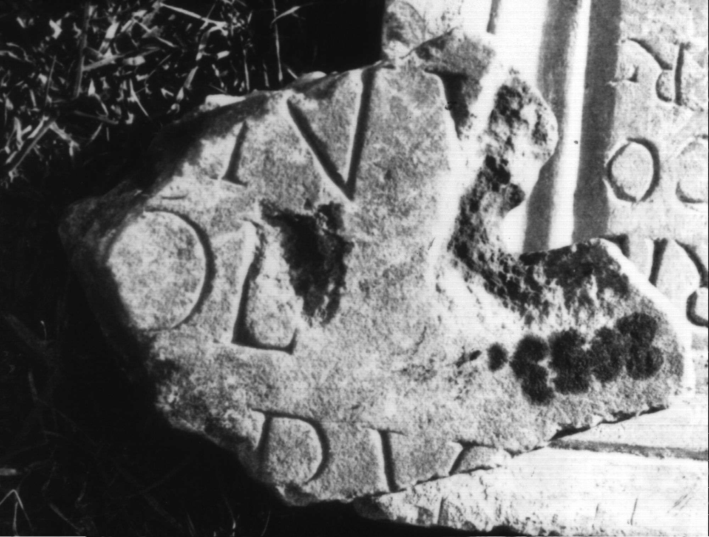

# EDH HD046184. Colonia Ulpia Traiana Sarmizegetusa

**Країна.** Румунія

**Провінція (код EDH).** Dac

**Місце знахідки (антична назва).** Colonia Ulpia Traiana Sarmizegetusa

**Сучасна назва.** Sarmizegetusa

**Координати.** 45.516666699,22.783333299

**Зберігання.** Deva, Muz. Civil. Dac. şi Rom.

**Датування (роки, від'ємні до н. е.).** 151 … 250

**Розміри (висота, ширина, глибина, см).** -14.0 × -18.0 × -3.0

## Текст (латинь, скорочення розкрито)

```
$] / [---]nu[s] / [--- c]ol(oniae) / [--- coll(egii)? fab?]ru[m?] / [&
```

## Текст у вихідному записі

```
] / [ ]NV[ ] / [ ]OL / [ ]RV[ ] / [
```

## Література

IDR 3, 2, 362; fig. 299 (Foto u. Zeichnung). #

## Фото



Джерело https://edh.ub.uni-heidelberg.de/edh/inschrift/HD046184, ліцензія CC BY-SA 4.0. Оригінальний XML в архіві сирі_дані/edh_xml.zip
