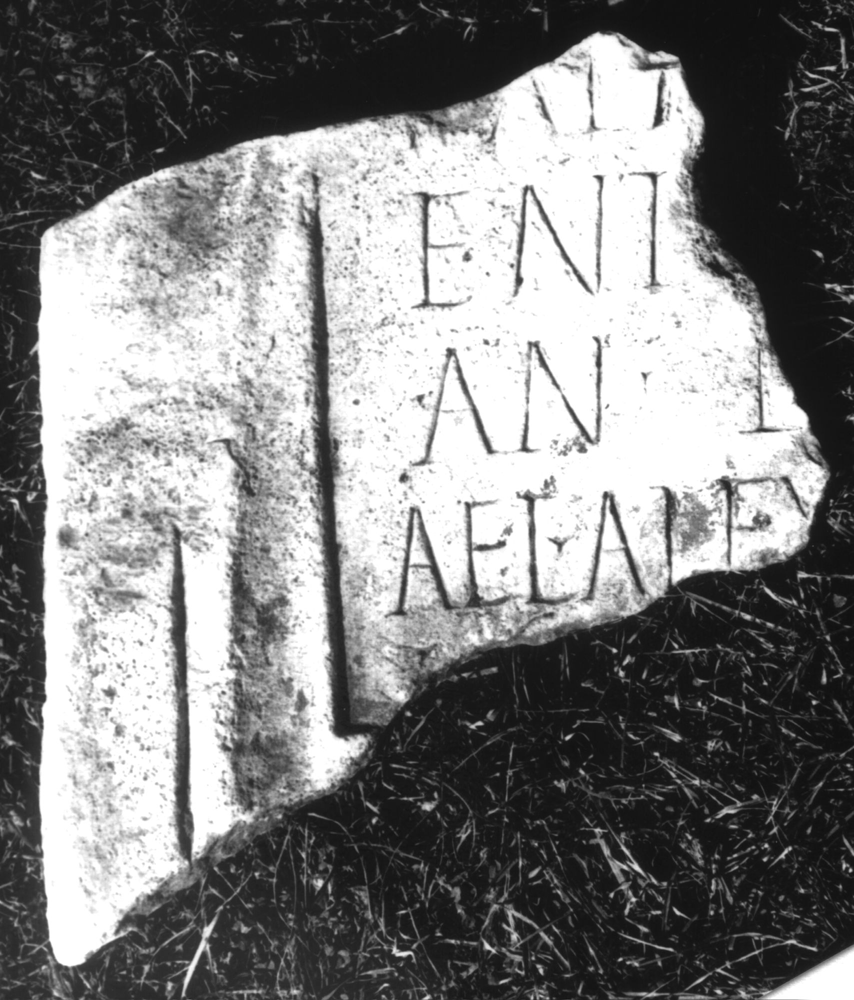

# EDH HD046186. Colonia Ulpia Traiana Sarmizegetusa

**Країна.** Румунія

**Провінція (код EDH).** Dac

**Місце знахідки (антична назва).** Colonia Ulpia Traiana Sarmizegetusa

**Сучасна назва.** Sarmizegetusa

**Координати.** 45.516666699,22.783333299

**Зберігання.** Deva, Muz. Civil. Dac. şi Rom.

**Датування (роки, від'ємні до н. е.).** 171 … 270

**Розміри (висота, ширина, глибина, см).** -38.0 × -35.0 × 6.0

## Текст (латинь, скорочення розкрито)

```
$] / Palm[yr(enorum)? ---]/ENT[--- vix(it)] / an(nos) L[---] / Ael(ius) Alex[ander] / C[---]
```

## Текст у вихідному записі

```
] / PALM[ ] / ENT[ ] / AN L[ ] / AEL ALEX[ ] / C[ ]
```

## Коментар

Z. 5: vor C wohl eher ein Worttrenner als ein I (IDR III: IC).

## Література

IDR 3, 2, 367; fig. 301 (Foto u. Zeichnung).
- CIL 03, 12592. #

## Фото



Джерело https://edh.ub.uni-heidelberg.de/edh/inschrift/HD046186, ліцензія CC BY-SA 4.0. Оригінальний XML в архіві сирі_дані/edh_xml.zip
