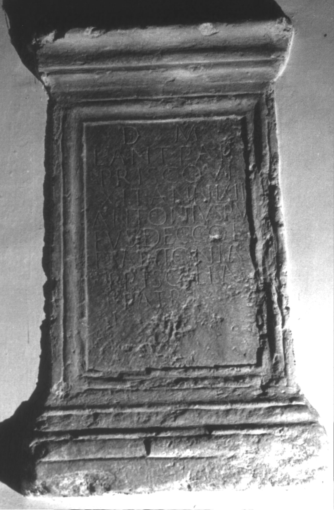

# EDH HD046191. Colonia Ulpia Traiana Sarmizegetusa, aus

**Країна.** Румунія

**Провінція (код EDH).** Dac

**Місце знахідки (антична назва).** Colonia Ulpia Traiana Sarmizegetusa, aus

**Сучасна назва.** Sântămăria-Orlea

**Деталі знахідки.** Adelshof (1690)

**Координати.** 45.590599999,22.970599999

**Зберігання.** Wien, Nationalbibl.

**Датування (роки, від'ємні до н. е.).** 151 … 230

**Тип пам'ятки.** Altar

## Текст (латинь, скорочення розкрито)

```
D(is) M(anibus) / L(ucio) Ant(onio) Pap(iria) / Prisco vi/xit ann(os) LXII / Antonius Ru/fus dec(urio) col(oniae) / et Antonia / Priscilla / patri
```

## Текст у вихідному записі

```
D M / L ANT PAP / PRISCO VI / XIT ANN LXII / ANTONIVS RV / FVS DEC COL / ET ANTONIA / PRISCILLA / PATRI
```

## Література

IDR 3, 2, 375; fig. 306 (Foto u. Zeichnung).
- CIL 03, 01489.
- A. Buonopane - V. La Monaca, in: G.P. Marchi - J. Pál (Hrsg.), Epigrafi romane di Transilvania. Bibliotheca Capitolare di Verona, Manoscritto CCLXVII (Verona - Szeged 2010) 254, Nr. 1; Foto u. Zeichnung. #

## Фото



Джерело https://edh.ub.uni-heidelberg.de/edh/inschrift/HD046191, ліцензія CC BY-SA 4.0. Оригінальний XML в архіві сирі_дані/edh_xml.zip
