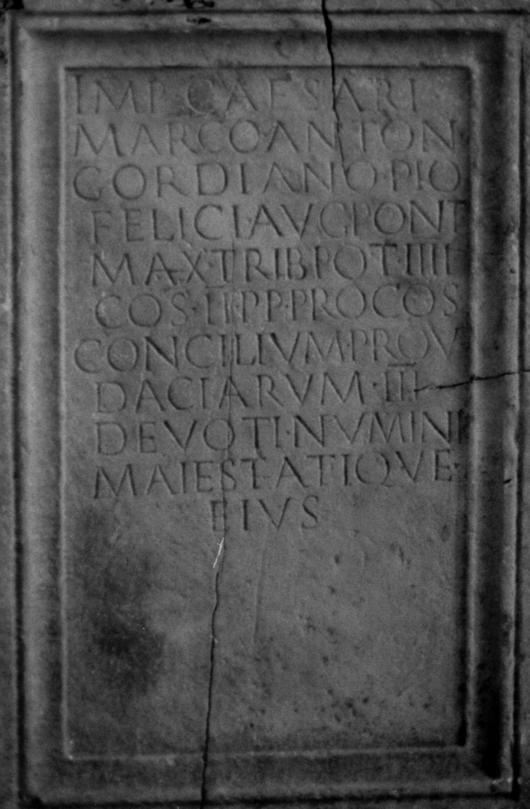
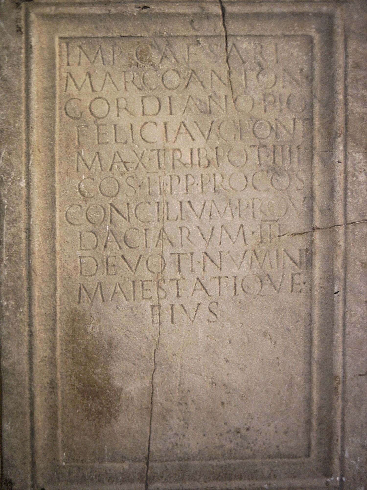
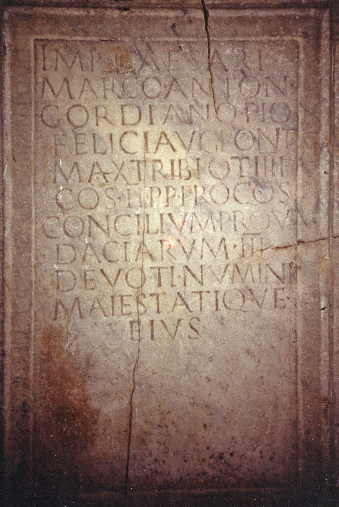

# EDH HD046318. Colonia Ulpia Traiana Sarmizegetusa

**Країна.** Румунія

**Провінція (код EDH).** Dac

**Місце знахідки (антична назва).** Colonia Ulpia Traiana Sarmizegetusa

**Сучасна назва.** Sarmizegetusa

**Координати.** 45.516666699,22.783333299

**Рік знахідки.** 1700

**Зберігання.** Cluj-Napoca, Muz. Naţ. Ist. Transilv.

**Датування (роки, від'ємні до н. е.).** 238 … 244

**Тип пам'ятки.** Statuenbasis?

**Розміри (висота, ширина, глибина, см).** -114.0 × -77.0 × -34.0

## Текст (латинь, скорочення розкрито)

```
Imp(eratori) Caesari / Marco Anton(io) / Gordiano Pio / Felici Aug(usto) pont(ifici) / max(imo) trib(unicia) pot(estate) IIII / co(n)s(uli) II p(atri) p(atriae) proco(n)s(uli) / concilium prov(inciarum) / Daciarum III / devoti numini / maiestatique / eius
```

## Текст у вихідному записі

```
IMP CAESARI / MARCO ANTON / GORDIANO PIO / FELICI AVG PONT / MAX TRIB POT IIII / COS II P P PROCOS / CONCILIVM PROV / DACIARVM III / DEVOTI NVMINI / MAIESTATIQVE / EIVS
```

## Коментар

Lediglich der Mittelteil erhalten.

## Література

CIL 03, 01454.
- ILS 7128.
- IDR 3, 2, 080; fig. 62 (Foto u. Zeichnung). #

## Фото







Джерело https://edh.ub.uni-heidelberg.de/edh/inschrift/HD046318, ліцензія CC BY-SA 4.0. Оригінальний XML в архіві сирі_дані/edh_xml.zip
