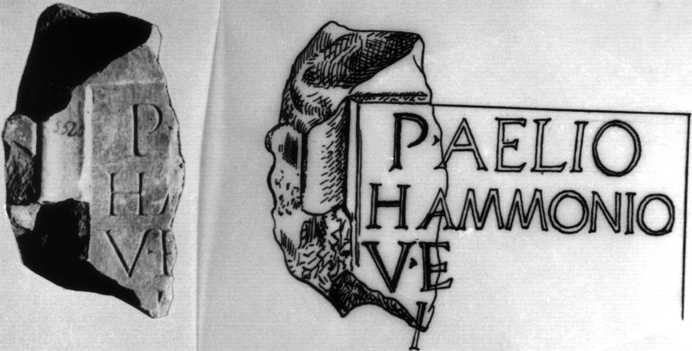
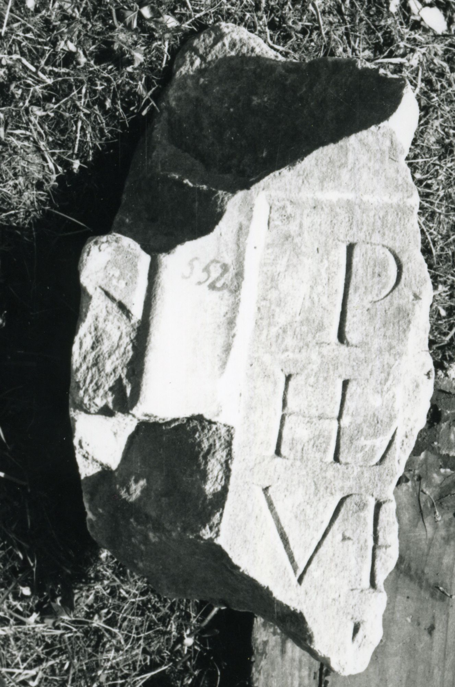

# EDH HD046342. Colonia Ulpia Traiana Sarmizegetusa

**Країна.** Румунія

**Провінція (код EDH).** Dac

**Місце знахідки (антична назва).** Colonia Ulpia Traiana Sarmizegetusa

**Сучасна назва.** Sarmizegetusa

**Координати.** 45.516666699,22.783333299

**Рік знахідки.** 1924

**Зберігання.** Sarmizegetusa, Muz. Arh.

**Датування (роки, від'ємні до н. е.).** 244 … 249

**Тип пам'ятки.** Statuenbasis?

**Розміри (висота, ширина, глибина, см).** -30.0 × -18.0 × -13.0

## Текст (латинь, скорочення розкрито)

```
P(ublio) A[elio] / Ha[mmonio] / v(iro) e(gregio) / I[&
```

## Текст у вихідному записі

```
P A[ ] / HA[ ] / V E / I[
```

## Література

IDR 3, 2, 083; fig. 64 (Zeichnung). #

## Фото





Джерело https://edh.ub.uni-heidelberg.de/edh/inschrift/HD046342, ліцензія CC BY-SA 4.0. Оригінальний XML в архіві сирі_дані/edh_xml.zip
