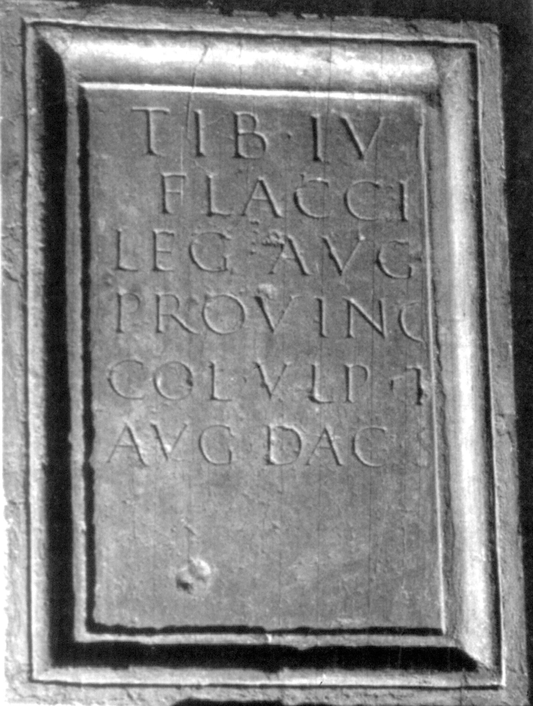

# EDH HD046389. Colonia Ulpia Traiana Sarmizegetusa, aus

**Країна.** Румунія

**Провінція (код EDH).** Dac

**Місце знахідки (антична назва).** Colonia Ulpia Traiana Sarmizegetusa, aus

**Сучасна назва.** Densuş

**Деталі знахідки.** {Peşteana}

**Координати.** 45.5479745,22.822122199

**Рік знахідки.** -1690

**Зберігання.** Wien, Nationalbibl. (Kopie)

**Датування (роки, від'ємні до н. е.).** 119 … 168

## Текст (латинь, скорочення розкрито)

```
Tib(erio) Iul[io] / Flacci[no] / leg(ato) Aug(usti) [pr(o) pr(aetore)] / provinc(iae) [Dac(iae)] / col(onia) Ulp(ia) T[rai(ana)] / Aug(usta) Dac(ica) S[arm(izegetusa)]
```

## Текст у вихідному записі

```
TIB IVL[ ] / FLACCI[ ] / LEG AVG [ ] / PROVINC [ ] / COL VLP T[ ] / AVG DAC S[ ]
```

## Коментар

Autopsie: Buonopane, 2009.

## Література

CIL 03, 01461.
- IDR 3, 2, 095; fig. 75 (Zeichnungen).
- PIR (2. Aufl.) I 310.
- I. Piso, Fasti provinciae Daciae 1. Die senatorischen Amtsträger (Bonn 1993) 77-79, Nr. 19, 2.
- A. Buonopane - V. La Monaca, in: G.P. Marchi - J. Pál (Hrsg.), Epigrafi romane di Transilvania. Bibliotheca Capitolare di Verona, Manoscritto CCLXVII (Verona - Szeged 2010) 260, Nr. 7; Foto u. Zeichnung.
- F. Beutler - E. Weber (Hrsg.), Die römischen Inschriften der Österreichischen Nationalbibliothek (Wien 2015) 68, Nr. 51; Foto. #

## Фото



Джерело https://edh.ub.uni-heidelberg.de/edh/inschrift/HD046389, ліцензія CC BY-SA 4.0. Оригінальний XML в архіві сирі_дані/edh_xml.zip
