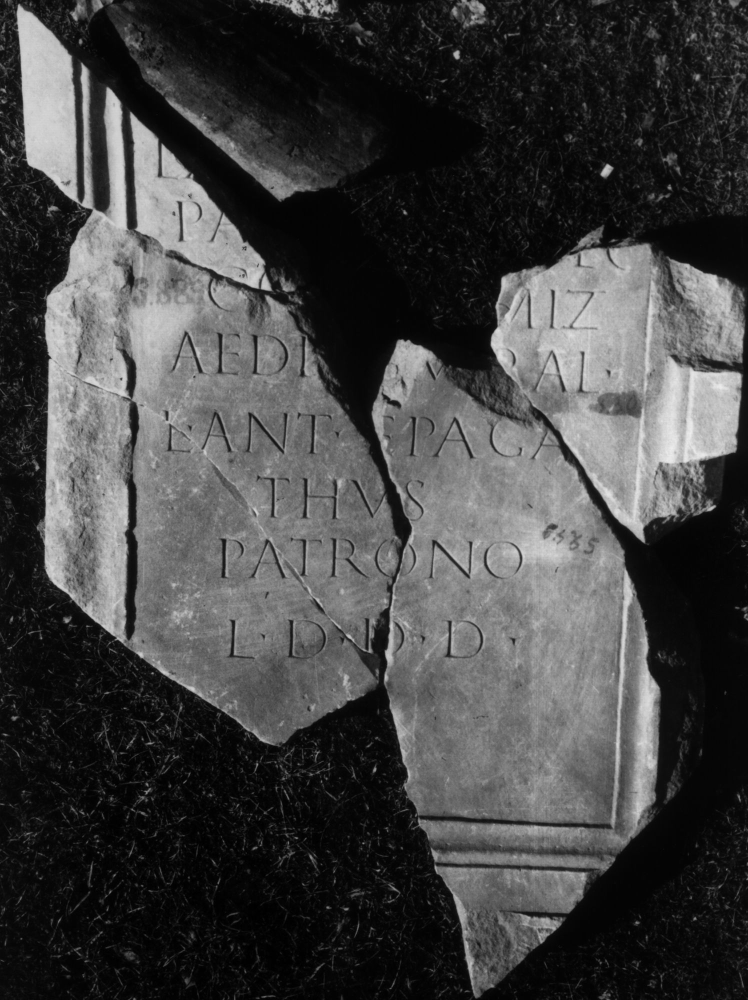

# EDH HD046393. Colonia Ulpia Traiana Sarmizegetusa

**Країна.** Румунія

**Провінція (код EDH).** Dac

**Місце знахідки (антична назва).** Colonia Ulpia Traiana Sarmizegetusa

**Сучасна назва.** Sarmizegetusa

**Деталі знахідки.** {Forum Novum, nördliche Kryptoportikus}

**Координати.** 45.512815618,22.787882326

**Рік знахідки.** -1930

**Зберігання.** Sarmizegetusa, Muz. Arh.

**Датування (роки, від'ємні до н. е.).** 107 … 200

**Тип пам'ятки.** Tafel

**Розміри (висота, ширина, глибина, см).** 105.0 × 74.0 × 10.0

## Текст (латинь, скорочення розкрито)

```
L(ucio) [Antonio L(uci) f(ilio)] / Pa[p(iria) Rufo dec(urioni)] / col(oniae) Sarmiz(egetusae) / aedi[l(icio) II]v[i]ral(i) / L(ucius) Ant(onius) Epaga/thus / patrono / l(ocus) d(atus) d(ecreto) d(ecurionum)
```

## Текст у вихідному записі

```
L [ ] / PA[ ] / COL SARMIZ / AEDI[ ]V[ ]RAL / L ANT EPAGA / THVS / PATRONO / L D D D
```

## Коментар

Maße rekonstruiert. Mehrere aneinander passende Fragmente erhalten.

## Література

IDR 3, 2, 104, fig. 82 (Foto u. Zeichnung). #

## Фото



Джерело https://edh.ub.uni-heidelberg.de/edh/inschrift/HD046393, ліцензія CC BY-SA 4.0. Оригінальний XML в архіві сирі_дані/edh_xml.zip
