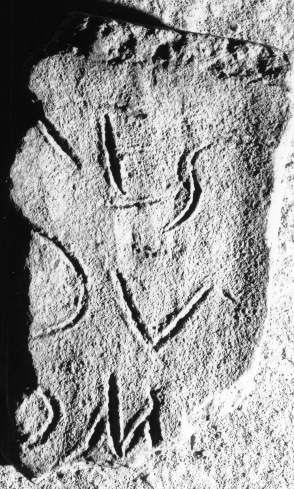

# EDH HD046398. Apulum

**Країна.** Румунія

**Провінція (код EDH).** Dac

**Місце знахідки (антична назва).** Apulum

**Сучасна назва.** Alba Iulia

**Деталі знахідки.** {Partoş}

**Координати.** 46.0463184,23.566650100

**Датування (роки, від'ємні до н. е.).** 107 … 275

**Матеріал.** Ton

**Тип пам'ятки.** Ziegel

## Текст (латинь, скорочення розкрито)

```
[---]ES / [---]DV / [---]OM / [&
```

## Текст у вихідному записі

```
[ ]ES / [ ]DV / [ ]OM / [
```

## Коментар

Nach IDR III eine Namensliste. Z. 1: vor E noch der Rest einer abfallenden Schräghaste.

## Література

IDR 3, 6, 309; fig. 306 (Zeichnung). #

## Фото



Джерело https://edh.ub.uni-heidelberg.de/edh/inschrift/HD046398, ліцензія CC BY-SA 4.0. Оригінальний XML в архіві сирі_дані/edh_xml.zip
