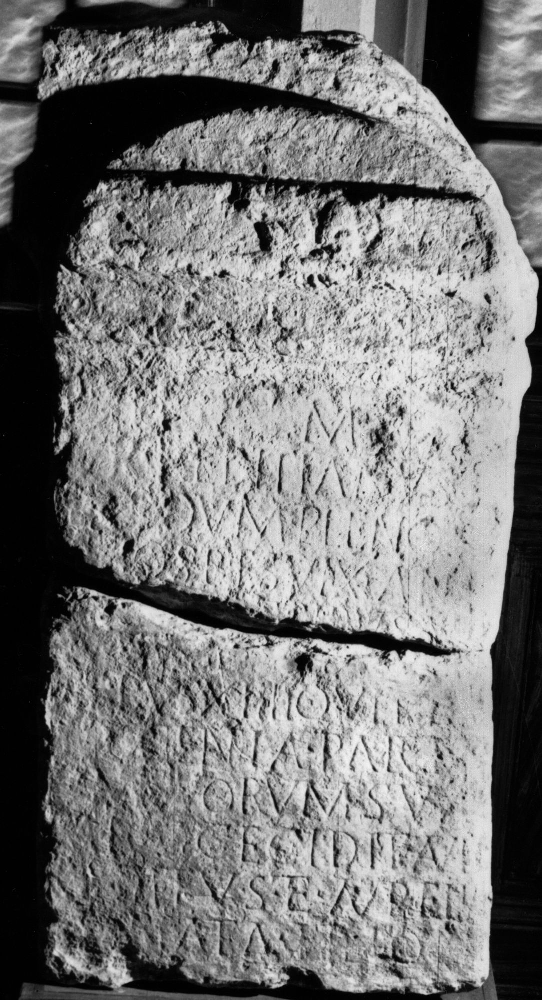

# EDH HD046402. Ad Mediam

**Країна.** Румунія

**Провінція (код EDH).** Dac

**Місце знахідки (антична назва).** Ad Mediam

**Сучасна назва.** Mehadia

**Деталі знахідки.** Schule, sekundär verwendet

**Координати.** 44.9065749,22.360437000

**Рік знахідки.** -1900

**Зберігання.** Băile Herculane, Muz. Ist.

**Датування (роки, від'ємні до н. е.).** 171 … 270

**Матеріал.** Gesteine

**Тип пам'ятки.** Altar

**Розміри (висота, ширина, глибина, см).** -103.0 × -50.0 × 32.0

## Текст (латинь, скорочення розкрито)

```
D(is) M(anibus) / Aur(elius) Peditianus / nondum plenos / [ann]os tres vix(it) an(nis) / duobus me(n)sibus VI / diebus XIIII qui et a / in(n)ocentia parent/um suorum sua / [ma]nu cecidit Aur(elius) / [P]editus et Aurelia / [D]onata filio / in(n)ocenti / [&?
```

## Текст у вихідному записі

```
D M / AVR PEDITIANVS / NONDVM PLENOS / [ ]OS TRES VIX AN / DVOBVS MESIBVS VI / DIEBVS XIIII QVI ET A / INOCENTIA PARENT / VM SVORVM SVA / [ ]NV CECIDIT AVR / [ ]EDITVS ET AVRELIA / [ ]ONATA FILIO / INOCENTI / [
```

## Коментар

Inzwischen sind viele Buchstaben nicht mehr lesbar, die bei der Auffindung. noch zu erkennen waren. (B): IDR III: Z. 7/8: parent/[u]m.

## Література

IDR 3, 1, 085; fig. 66 (Foto u. Zeichnung). (B)
- CIL 03, 01578.
- CIL 03, 08013.
- CIL 03, 12596. #

## Фото



Джерело https://edh.ub.uni-heidelberg.de/edh/inschrift/HD046402, ліцензія CC BY-SA 4.0. Оригінальний XML в архіві сирі_дані/edh_xml.zip
