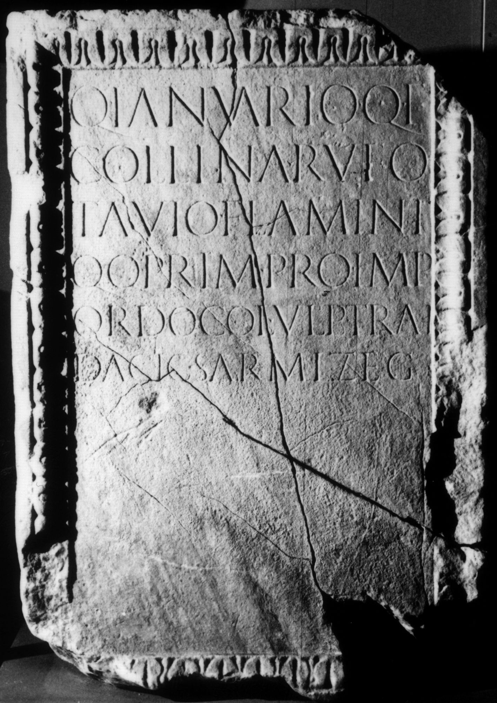

# EDH HD046413. Colonia Ulpia Traiana Sarmizegetusa, aus

**Країна.** Румунія

**Провінція (код EDH).** Dac

**Місце знахідки (антична назва).** Colonia Ulpia Traiana Sarmizegetusa, aus

**Сучасна назва.** Densuş

**Деталі знахідки.** {Curia Nopcsa}

**Координати.** 45.578344987,22.804677486

**Рік знахідки.** 1850

**Зберігання.** Deva, Muz. Civil. Dac. şi Rom.

**Датування (роки, від'ємні до н. е.).** 107 … 200

**Тип пам'ятки.** Altar?

**Розміри (висота, ширина, глибина, см).** -87.0 × -60.0 × -60.0

## Текст (латинь, скорочення розкрито)

```
Q(uinto) Ianuario Q(uinti) f(ilio) / Collina Rufo / Tavio flamini / q(uin)q(uennali) prim(o) pro Imp(eratore) / ordo col(oniae) Ulp(iae) Trai(anae) / Dacic(ae) Sarmizeg(etusae)
```

## Текст у вихідному записі

```
Q IANVARIO Q F / COLLINA RVFO / TAVIO FLAMINI / QQ PRIM PRO IMP / ORDO COL VLP TRAI / DACIC SARMIZEG
```

## Література

CIL 03, 01503.
- ILS 7134.
- IDR 3, 2, 112; fig. 87. #

## Фото



Джерело https://edh.ub.uni-heidelberg.de/edh/inschrift/HD046413, ліцензія CC BY-SA 4.0. Оригінальний XML в архіві сирі_дані/edh_xml.zip
