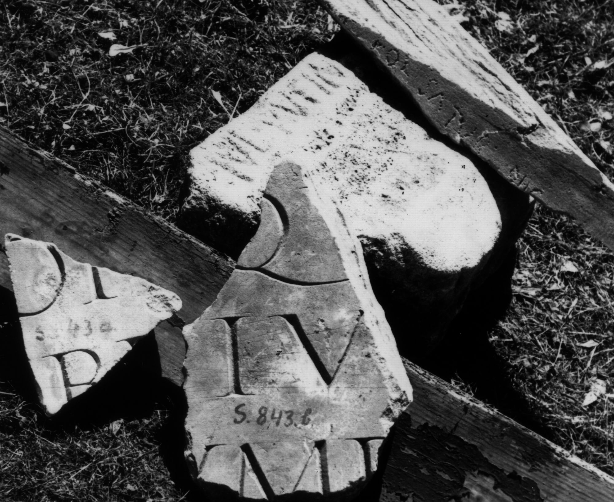

# EDH HD046417. Colonia Ulpia Traiana Sarmizegetusa

**Країна.** Румунія

**Провінція (код EDH).** Dac

**Місце знахідки (антична назва).** Colonia Ulpia Traiana Sarmizegetusa

**Сучасна назва.** Sarmizegetusa

**Координати.** 45.516666699,22.783333299

**Зберігання.** Sarmizegetusa, Muz. Arh.

**Датування (роки, від'ємні до н. е.).** 151 … 170

**Матеріал.** Marmor

**Тип пам'ятки.** Tafel?

**Розміри (висота, ширина, глибина, см).** 24.0 × 22.0 × 8.0

## Текст (латинь, скорочення розкрито)

```
[M(arco)] Op[ellio M(arci) f(ilio) Pap(iria) Adiu]/[t]ori qu[aestori aedi]/[li I]Iv[iro patr(ono)? coll(egii)? fa]/[br]um F(?)[&
```

## Текст у вихідному записі

```
[ ] OP[ ] / [ ]ORI QV[ ] / [ ]IV[ ] / [ ]VM F[
```

## Коментар

Zwei nicht aneinander passende Fragmente erhalten. Abmessungen des größeren Fragments: s. o.; Abmessungen des kleineren Fragments: 18.5 x 17 x 5.

## Література

IDR 3, 2, 117; fig. 92 (Zeichnung). #

## Фото



Джерело https://edh.ub.uni-heidelberg.de/edh/inschrift/HD046417, ліцензія CC BY-SA 4.0. Оригінальний XML в архіві сирі_дані/edh_xml.zip
