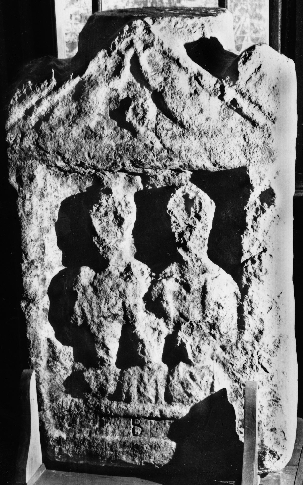

# EDH HD046423. Ad Mediam, aus?

**Країна.** Румунія

**Провінція (код EDH).** Dac

**Місце знахідки (антична назва).** Ad Mediam, aus?

**Сучасна назва.** Iablaniţa

**Деталі знахідки.** {Petnic}

**Координати.** 44.977899,22.288000199

**Зберігання.** Băile Herculane, Muz. Ist.

**Датування (роки, від'ємні до н. е.).** 131 … 270

**Тип пам'ятки.** Stele

**Розміри (висота, ширина, глибина, см).** -108.0 × 67.0 × 41.0

## Текст (латинь, скорочення розкрито)

```
B(?) // [&
```

## Текст у вихідному записі

```
B / / [
```

## Коментар

Oberer Teil einer Stele mit den Büsten zweier Erwachsener und dreier Kinder; Buchstabe B (zwischen dem Bildfeld und dem Rahmen des ansonsten nicht mehr erhaltenen Inschriftfeld) möglicherweise nicht antik.

## Література

IDR 3, 1, 104; fig. 81. #

## Фото



Джерело https://edh.ub.uni-heidelberg.de/edh/inschrift/HD046423, ліцензія CC BY-SA 4.0. Оригінальний XML в архіві сирі_дані/edh_xml.zip
