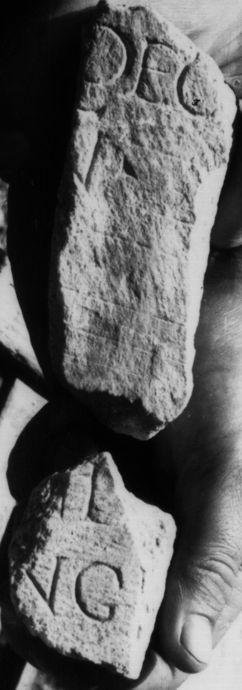

# EDH HD046512. Colonia Ulpia Traiana Sarmizegetusa

**Країна.** Румунія

**Провінція (код EDH).** Dac

**Місце знахідки (антична назва).** Colonia Ulpia Traiana Sarmizegetusa

**Сучасна назва.** Sarmizegetusa

**Координати.** 45.516666699,22.783333299

**Зберігання.** Sarmizegetusa, Muz. Arh.

**Датування (роки, від'ємні до н. е.).** 107 … 250

**Тип пам'ятки.** Tafel

**Розміри (висота, ширина, глибина, см).** 12.0 × 5.0 × 7.0

## Текст (латинь, скорочення розкрито)

```
$]il[ius? ---] / [--- Lo]ngi[nus? & // $] dec(urio) / [---] n(ostri)(?)
```

## Текст у вихідному записі

```
]IL[ ] / [ ]NGI[ / / ] DEC / [ ] N
```

## Коментар

Zwei nicht aneinander passende Fragmente erhalten. Abmessungen des größeren Fragments: s. o.; Abmessungen des kleineren Fragment: 6 x 4 x 6.

## Література

IDR 3, 2, 132; fig. 106. #

## Фото



Джерело https://edh.ub.uni-heidelberg.de/edh/inschrift/HD046512, ліцензія CC BY-SA 4.0. Оригінальний XML в архіві сирі_дані/edh_xml.zip
