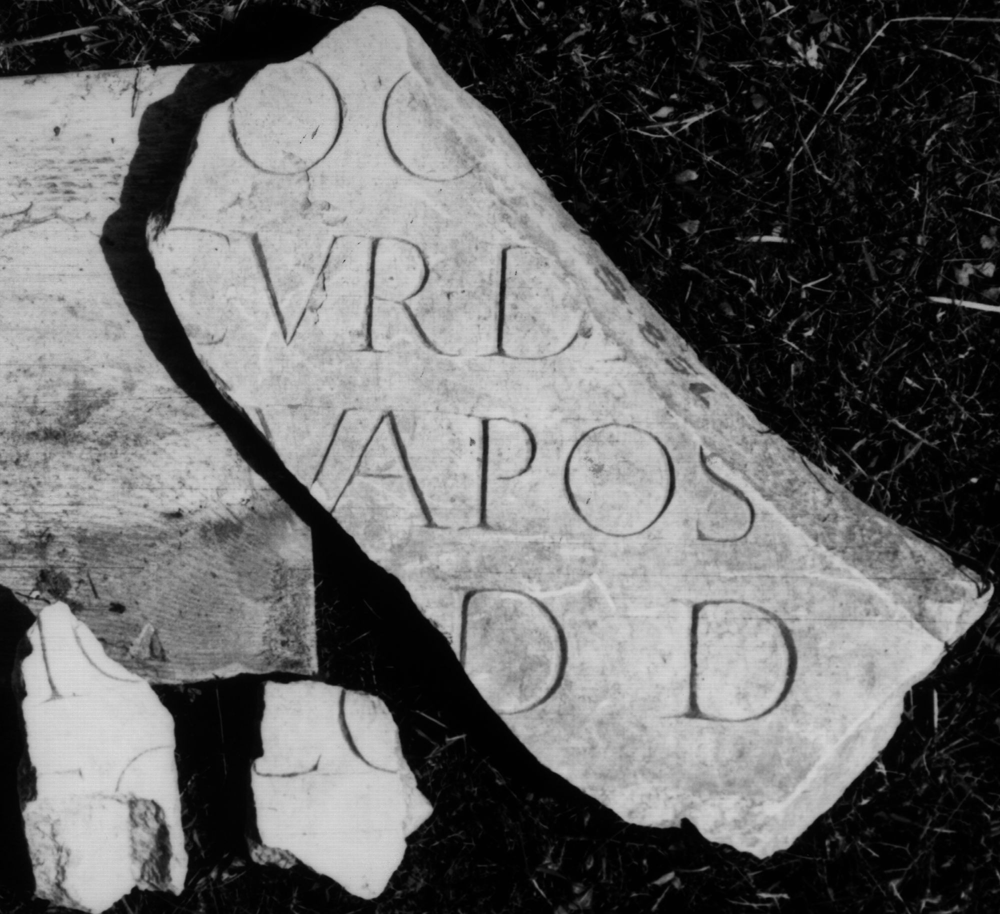

# EDH HD046516. Colonia Ulpia Traiana Sarmizegetusa

**Країна.** Румунія

**Провінція (код EDH).** Dac

**Місце знахідки (антична назва).** Colonia Ulpia Traiana Sarmizegetusa

**Сучасна назва.** Sarmizegetusa

**Координати.** 45.516666699,22.783333299

**Зберігання.** Deva, Muz. Civil. Dac. şi Rom.

**Датування (роки, від'ємні до н. е.).** 131 … 200

**Тип пам'ятки.** Tafel

**Розміри (висота, ширина, глибина, см).** -32.0 × -18.0 × 7.0

## Текст (латинь, скорочення розкрито)

```
$]oc[---] / [pro]cur(atoris) Da[ciae] / [pec(unia) s]ua pos[uit] / [l(ocus) d(atus)] d(ecreto) d(ecurionum) // $]IO[& // $]LP[&
```

## Текст у вихідному записі

```
]OC[ ] / [ ]CVR DA[ ] / [ ]VA POS[ ] / [ ] D D / / ]IO[ / / ]LP[
```

## Коментар

Drei nicht aneinander passende Fragmente erhalten. Angegeben nur die Abmessungen des größeren Fragments.

## Література

IDR 3, 2, 138; fig. 111 (Foto u. Zeichnung). #

## Фото



Джерело https://edh.ub.uni-heidelberg.de/edh/inschrift/HD046516, ліцензія CC BY-SA 4.0. Оригінальний XML в архіві сирі_дані/edh_xml.zip
