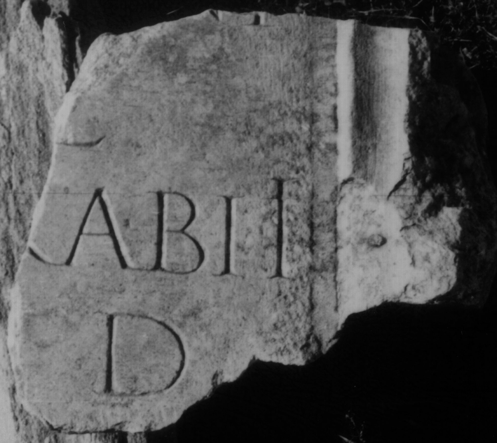

# EDH HD046520. Colonia Ulpia Traiana Sarmizegetusa

**Країна.** Румунія

**Провінція (код EDH).** Dac

**Місце знахідки (антична назва).** Colonia Ulpia Traiana Sarmizegetusa

**Сучасна назва.** Sarmizegetusa

**Координати.** 45.516666699,22.783333299

**Зберігання.** Sarmizegetusa, Muz. Arh.

**Датування (роки, від'ємні до н. е.).** 107 … 250

**Тип пам'ятки.** Statuenbasis?

**Розміри (висота, ширина, глибина, см).** -18.0 × -20.0 × 7.0

## Текст (латинь, скорочення розкрито)

```
$] / [---]ni / [femina]e(?) / [---? incompa]rabili / [l(ocus) d(atus) d(ecreto)] d(ecurionum)
```

## Текст у вихідному записі

```
] / [ ]NI / [ ]E / [ ]RABILI / [ ] D
```

## Література

IDR 3, 2, 141; fig. 114 (Foto u. Zeichnung). #

## Фото



Джерело https://edh.ub.uni-heidelberg.de/edh/inschrift/HD046520, ліцензія CC BY-SA 4.0. Оригінальний XML в архіві сирі_дані/edh_xml.zip
