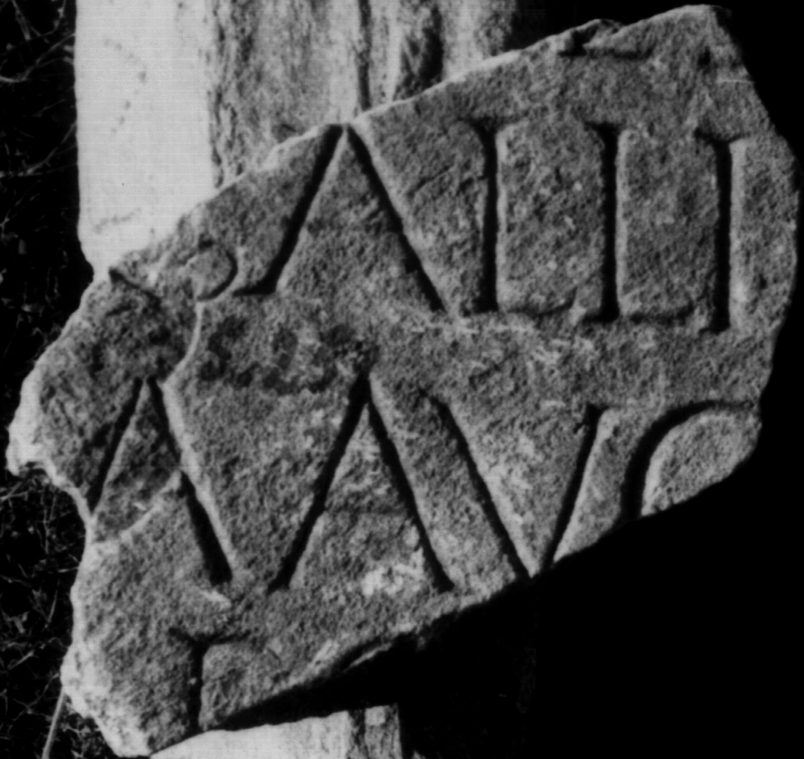
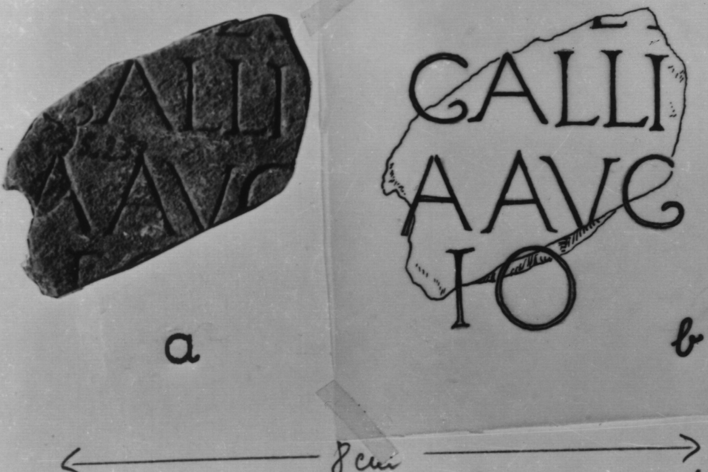

# EDH HD046521. Colonia Ulpia Traiana Sarmizegetusa

**Країна.** Румунія

**Провінція (код EDH).** Dac

**Місце знахідки (антична назва).** Colonia Ulpia Traiana Sarmizegetusa

**Сучасна назва.** Sarmizegetusa

**Координати.** 45.516666699,22.783333299

**Зберігання.** Sarmizegetusa, Muz. Arh.

**Датування (роки, від'ємні до н. е.).** 151 … 250

**Матеріал.** Marmor

**Тип пам'ятки.** Tafel

**Розміри (висота, ширина, глибина, см).** -10.0 × -14.0 × 3.0

## Текст (латинь, скорочення розкрито)

```
$]ES[---] / [---] Gallic[anus ---] / [--- vern]a(?) Aug(usti) [n(ostri)] / [---]E(?)O(?)[&
```

## Текст у вихідному записі

```
]ES[ ] / [ ] GALLIC[ ] / [ ]A AVG [ ] / [ ]EO[
```

## Коментар

Lesung nach IDR; weiterer Vorschlag nach IDR: Z. 3: --- Traian]a Aug(usta) [Dacjica ---?].

## Література

IDR 3, 2, 142; fig. 115 (Zeichnung). #

## Фото





Джерело https://edh.ub.uni-heidelberg.de/edh/inschrift/HD046521, ліцензія CC BY-SA 4.0. Оригінальний XML в архіві сирі_дані/edh_xml.zip
