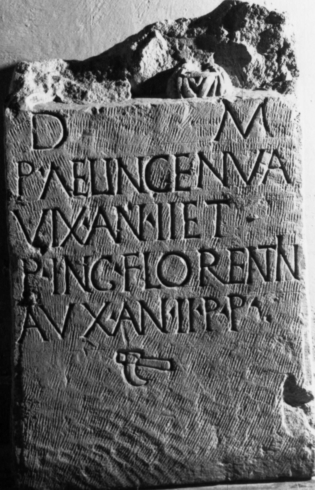

# EDH HD046531. Tibiscum

**Країна.** Румунія

**Провінція (код EDH).** Dac

**Місце знахідки (антична назва).** Tibiscum

**Сучасна назва.** Caransebeş

**Деталі знахідки.** Jupa, {Herrenhaus}

**Координати.** 45.458724427,22.186123319

**Зберігання.** Lugoj, Muz. Ist. Etnogr. Arta

**Датування (роки, від'ємні до н. е.).** 171 … 270

**Тип пам'ятки.** Stele

**Розміри (висота, ширина, глибина, см).** -80.0 × 49.0 × 17.0

## Текст (латинь, скорочення розкрито)

```
D(is) M(anibus) / P(ublia) Ael(ia) In<g=C>enua#In<g>enua#INCENUA / vix(it) an(nos) II et / P(ublia) Ing(enua) Florentin/a v(i)x(it) an(nos) II p(arentes?) p(osuerunt?)
```

## Текст у вихідному записі

```
D M / P AEL INCENVA / VIX AN II ET / P ING FLORENTIN / A VX AN II P P
```

## Коментар

Oberhalb des Inschriftfeldes noch Reste von 2 Büsten; unter der Inschrift eine ascia. Zeilenlinien für die Beschriftung. (B): Daicoviciu; Ardevan: Leseabweichnungen.

## Література

AE 2006, 1108.
- IDR 3, 1, 159; fig. 127 (Foto u. Zeichnung).
- C. Daicoviciu, AISC 1, 2, 1928-1932, 62-63. (B)
- R. Ardevan, in: HPS 13 (Debrecen 2006) 123-124, Nr. 4; Abb. 4 (Zeichnung). (B) - AE 2006. #

## Фото



Джерело https://edh.ub.uni-heidelberg.de/edh/inschrift/HD046531, ліцензія CC BY-SA 4.0. Оригінальний XML в архіві сирі_дані/edh_xml.zip
