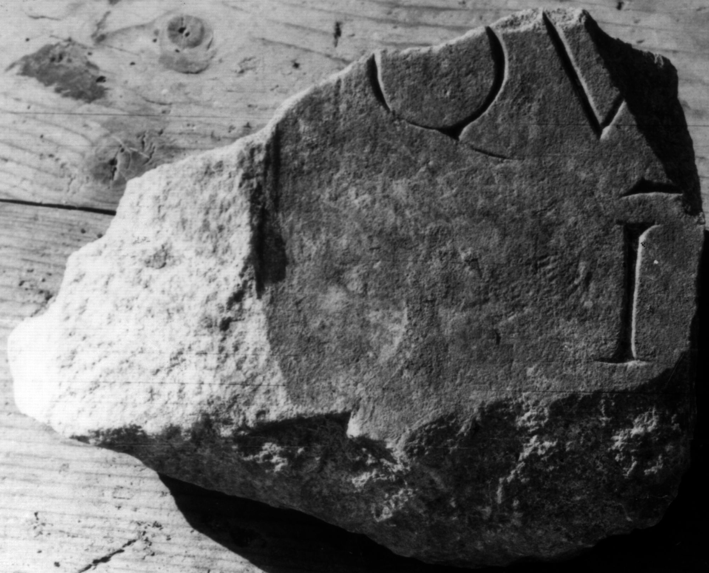
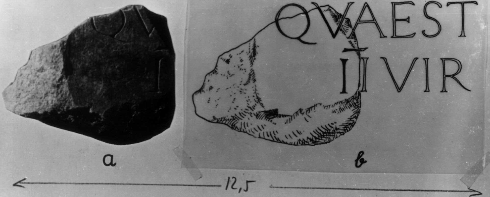

# EDH HD046591. Colonia Ulpia Traiana Sarmizegetusa

**Країна.** Румунія

**Провінція (код EDH).** Dac

**Місце знахідки (антична назва).** Colonia Ulpia Traiana Sarmizegetusa

**Сучасна назва.** Sarmizegetusa

**Координати.** 45.516666699,22.783333299

**Зберігання.** Sarmizegetusa, Muz. Arh.

**Датування (роки, від'ємні до н. е.).** 107 … 250

**Тип пам'ятки.** Statuenbasis?

**Розміри (висота, ширина, глибина, см).** -18.0 × -24.0 × -12.0

## Текст (латинь, скорочення розкрито)

```
$] / qu[aestor ---] / I[Ivir &
```

## Текст у вихідному записі

```
] / QV[ ] / I[
```

## Література

IDR 3, 2, 144; fig. 117 (Foto u. Zeichnung). #

## Фото





Джерело https://edh.ub.uni-heidelberg.de/edh/inschrift/HD046591, ліцензія CC BY-SA 4.0. Оригінальний XML в архіві сирі_дані/edh_xml.zip
