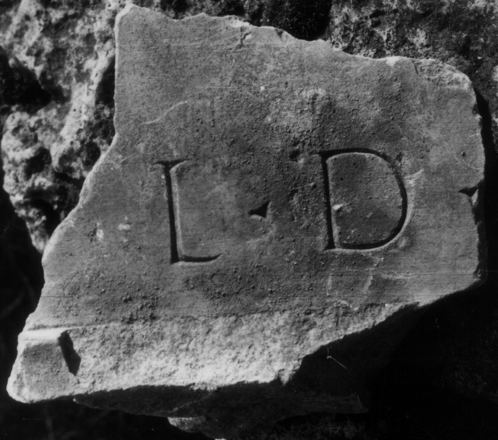

# EDH HD046595. Colonia Ulpia Traiana Sarmizegetusa

**Країна.** Румунія

**Провінція (код EDH).** Dac

**Місце знахідки (антична назва).** Colonia Ulpia Traiana Sarmizegetusa

**Сучасна назва.** Sarmizegetusa

**Деталі знахідки.** {Forum Vetus, Nord-West-Ecke}

**Координати.** 45.513504953,22.787401593

**Рік знахідки.** 1924

**Зберігання.** Sarmizegetusa, Muz. Arh.

**Датування (роки, від'ємні до н. е.).** 107 … 250

**Тип пам'ятки.** Tafel

**Розміри (висота, ширина, глибина, см).** -11.0 × -13.0 × 9.0

## Текст (латинь, скорочення розкрито)

```
$] l(ocus) d(atus) [d(ecreto) d(ecurionum)]
```

## Текст у вихідному записі

```
] L D [ ]
```

## Література

IDR 3, 2, 149; fig. 122 (Foto u. Zeichnung). #

## Фото



Джерело https://edh.ub.uni-heidelberg.de/edh/inschrift/HD046595, ліцензія CC BY-SA 4.0. Оригінальний XML в архіві сирі_дані/edh_xml.zip
