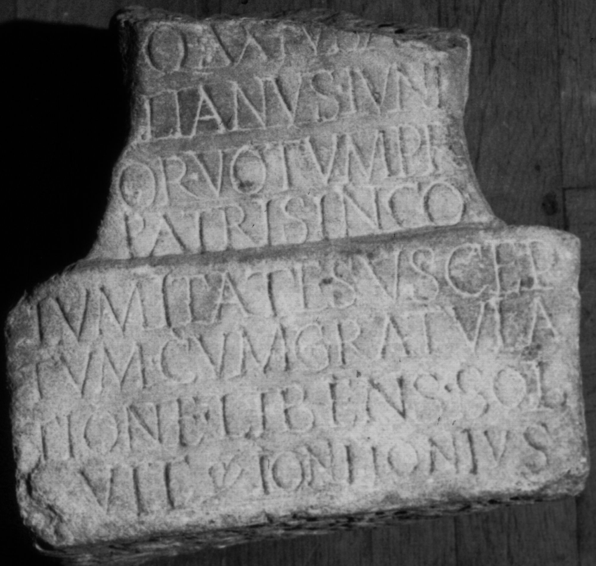

# EDH HD046605. Colonia Ulpia Traiana Sarmizegetusa

**Країна.** Румунія

**Провінція (код EDH).** Dac

**Місце знахідки (антична назва).** Colonia Ulpia Traiana Sarmizegetusa

**Сучасна назва.** Sarmizegetusa

**Координати.** 45.516666699,22.783333299

**Рік знахідки.** 1882

**Зберігання.** Sibiu, Muz. Brukenthal

**Датування (роки, від'ємні до н. е.).** 231 … 250

**Тип пам'ятки.** Altar

**Розміри (висота, ширина, глибина, см).** -182.0 × -108.0

## Текст (латинь, скорочення розкрито)

```
[Aesculapio] / [et Hygiae] / Q(uintus) Axius Ae/lianus iuni/or votum pro / patris inco/lumitate suscep/tum cum gratula/tione libens sol/vit Ioni Ionius
```

## Текст у вихідному записі

```
[ ] / [ ] / Q AXIVS AE / LIANVS IVNI / OR VOTVM PRO / PATRIS INCO / LVMITATE SVSCEP / TVM CVM GRATVLA / TIONE LIBENS SOL / VIT IONI IONIVS
```

## Коментар

Hedera.

## Література

CIL 03, 07899.
- ILS 3849.
- IDR 3, 2, 158; fig. 129 (Foto u. Zeichnung).
- PIR (2. Aufl.) A 1689. #

## Фото



Джерело https://edh.ub.uni-heidelberg.de/edh/inschrift/HD046605, ліцензія CC BY-SA 4.0. Оригінальний XML в архіві сирі_дані/edh_xml.zip
