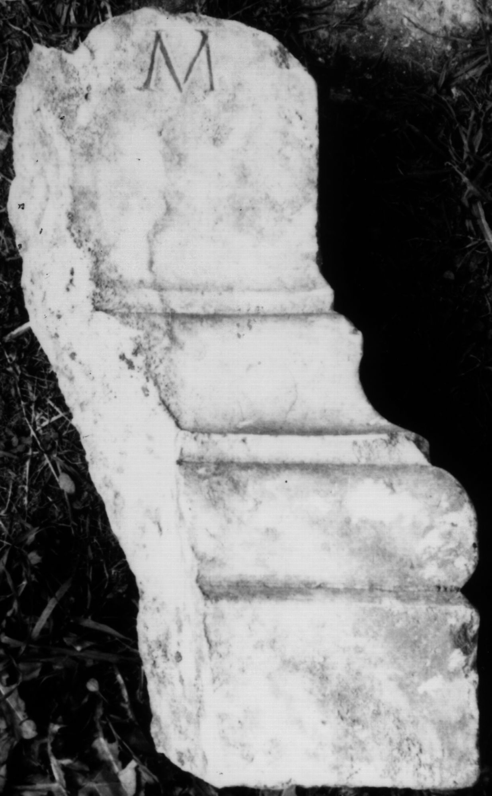

# EDH HD046639. Colonia Ulpia Traiana Sarmizegetusa

**Країна.** Румунія

**Провінція (код EDH).** Dac

**Місце знахідки (антична назва).** Colonia Ulpia Traiana Sarmizegetusa

**Сучасна назва.** Sarmizegetusa

**Деталі знахідки.** {Tempel des Aesculapius und der Hygia}

**Координати.** 45.517571787,22.788294553

**Рік знахідки.** 1973

**Зберігання.** Sarmizegetusa, Muz. Arh.

**Датування (роки, від'ємні до н. е.).** 107 … 250

**Тип пам'ятки.** Altar

**Розміри (висота, ширина, глибина, см).** -32.0 × -12.0 × -14.0

## Текст (латинь, скорочення розкрито)

```
$] / [v(otum) s(olvit)] l(ibens) m(erito)
```

## Текст у вихідному записі

```
] / [ ] L M
```

## Література

IDR 3, 2, 179; fig. 141 (Foto u. Zeichnung). #

## Фото



Джерело https://edh.ub.uni-heidelberg.de/edh/inschrift/HD046639, ліцензія CC BY-SA 4.0. Оригінальний XML в архіві сирі_дані/edh_xml.zip
