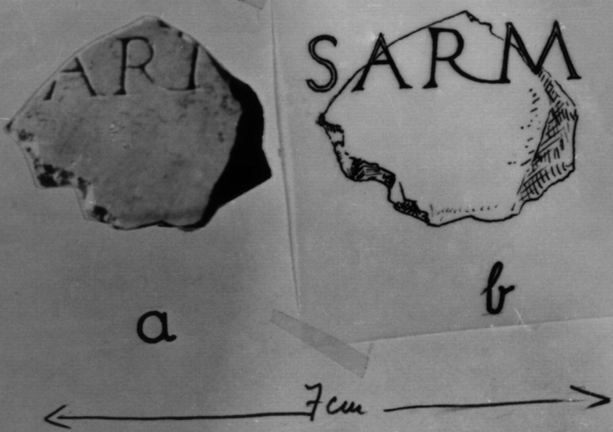

# EDH HD046642. Colonia Ulpia Traiana Sarmizegetusa

**Країна.** Румунія

**Провінція (код EDH).** Dac

**Місце знахідки (антична назва).** Colonia Ulpia Traiana Sarmizegetusa

**Сучасна назва.** Sarmizegetusa

**Деталі знахідки.** {Tempel des Aesculapius und der Hygia}

**Координати.** 45.517571787,22.788294553

**Зберігання.** Sarmizegetusa, Muz. Arh.

**Датування (роки, від'ємні до н. е.).** 107 … 250

**Тип пам'ятки.** Tafel

**Розміри (висота, ширина, глибина, см).** -13.0 × -13.0 × 5.0

## Текст (латинь, скорочення розкрито)

```
$ S]arm[(izegetusa?) ---?]
```

## Текст у вихідному записі

```
]ARM[ ]
```

## Література

IDR 3, 2, 182; fig. 144 (Foto u. Zeichnung). #

## Фото



Джерело https://edh.ub.uni-heidelberg.de/edh/inschrift/HD046642, ліцензія CC BY-SA 4.0. Оригінальний XML в архіві сирі_дані/edh_xml.zip
