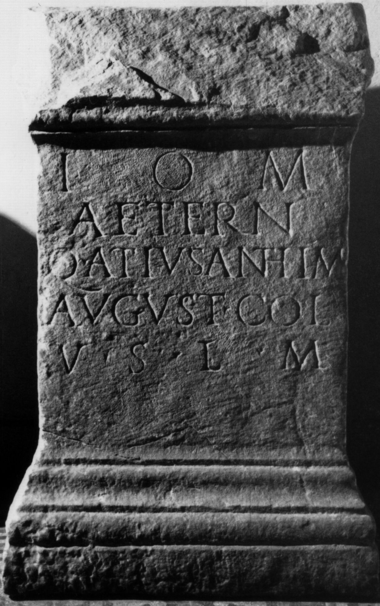

# EDH HD046645. Colonia Ulpia Traiana Sarmizegetusa

**Країна.** Румунія

**Провінція (код EDH).** Dac

**Місце знахідки (антична назва).** Colonia Ulpia Traiana Sarmizegetusa

**Сучасна назва.** Sarmizegetusa

**Координати.** 45.516666699,22.783333299

**Рік знахідки.** 1877

**Зберігання.** Lugoj, Muz. Ist. Etnogr. Arta

**Датування (роки, від'ємні до н. е.).** 107 … 200

**Тип пам'ятки.** Altar

**Розміри (висота, ширина, глибина, см).** -87.0 × -56.0 × -42.0

## Текст (латинь, скорочення розкрито)

```
I(ovi) O(ptimo) M(aximo) / Aetern(o) / Q(uintus) At(t)ius Anthim(us) / August(alis) col(oniae) / v(otum) s(olvit) l(ibens) m(erito)
```

## Текст у вихідному записі

```
I O M / AETERN / Q ATIVS ANTHIM / AVGVST COL / V S L M
```

## Література

IDR 3, 2, 185; fig. 147.
- CIL 03, 07913. #

## Фото



Джерело https://edh.ub.uni-heidelberg.de/edh/inschrift/HD046645, ліцензія CC BY-SA 4.0. Оригінальний XML в архіві сирі_дані/edh_xml.zip
