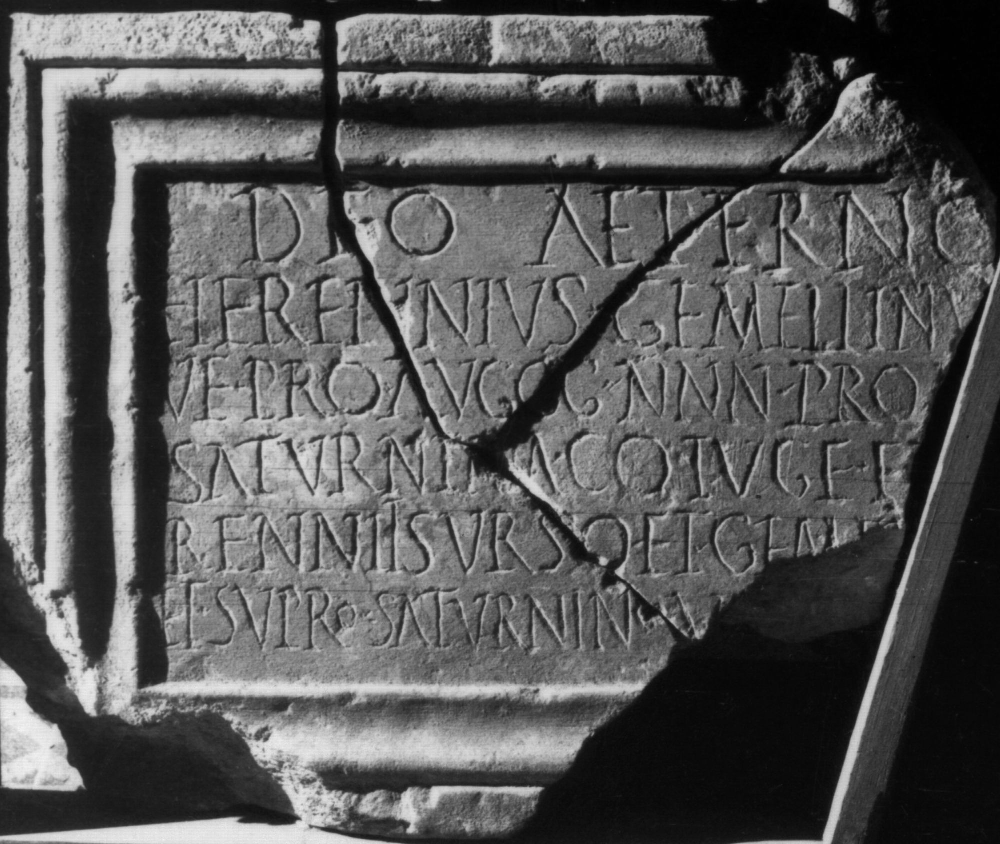

# EDH HD046655. Colonia Ulpia Traiana Sarmizegetusa

**Країна.** Румунія

**Провінція (код EDH).** Dac

**Місце знахідки (антична назва).** Colonia Ulpia Traiana Sarmizegetusa

**Сучасна назва.** Sarmizegetusa

**Координати.** 45.516666699,22.783333299

**Рік знахідки.** 1880

**Зберігання.** Lugoj, Muz. Ist. Etnogr. Arta

**Датування (роки, від'ємні до н. е.).** 198 … 211

**Тип пам'ятки.** Tafel

**Розміри (висота, ширина, глибина, см).** 39.0 × 54.0

## Текст (латинь, скорочення розкрито)

```
Deo Aeterno / Herennius Gemellinu[s] / v(ir) e(gregius) pro(curator) Auggg(ustorum) nnn(ostrorum) pro A(?)[el(ia)?] / Saturnina co(n)iuge et [He]/renniis Urso et Gemel[lino] / et Sup(e)ro Saturnino v[ot(um) lib(ens) sol(vit)]
```

## Текст у вихідному записі

```
DEO AETERNO / HERENNIVS GEMELLINV[ ] / V E PRO AVGGG NNN PRO A[ ] / SATVRNINA COIVGE ET [ ] / RENNIIS VRSO ET GEMEL[ ] / ET SVPRO SATVRNINO V[ ]
```

## Література

CIL 03, 07901.
- IDR 3, 2, 188; fig. 150 (Foto u. Zeichnung).
- PIR (2. Aufl.) H 109.
- H.-G. Pflaum, Les carrières procuratoriennes équestres sous le Haut-Empire romain (Paris 1960/61) 688, Nr. 254.
- PME H 14. #

## Фото



Джерело https://edh.ub.uni-heidelberg.de/edh/inschrift/HD046655, ліцензія CC BY-SA 4.0. Оригінальний XML в архіві сирі_дані/edh_xml.zip
