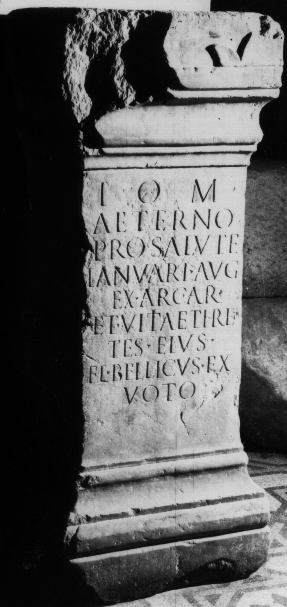

# EDH HD046656. Colonia Ulpia Traiana Sarmizegetusa

**Країна.** Румунія

**Провінція (код EDH).** Dac

**Місце знахідки (антична назва).** Colonia Ulpia Traiana Sarmizegetusa

**Сучасна назва.** Sarmizegetusa

**Координати.** 45.516666699,22.783333299

**Рік знахідки.** 1876

**Зберігання.** Lugoj, Muz. Ist. Etnogr. Arta

**Датування (роки, від'ємні до н. е.).** 107 … 250

**Тип пам'ятки.** Altar

**Розміри (висота, ширина, глибина, см).** 107.0 × -42.0 × -42.0

## Текст (латинь, скорочення розкрито)

```
I(ovi) O(ptimo) M(aximo) / Aeterno / pro salute / Ianuari Aug(usti) / ex arcar(io) / et Vitiae Threp/tes eius / Fl(avius) Bellicus ex / voto
```

## Текст у вихідному записі

```
I O M / AETERNO / PRO SALVTE / IANVARI AVG / EX ARCAR / ET VITIAE THREP / TES EIVS / FL BELLICVS EX / VOTO
```

## Література

CIL 03, 07912.
- IDR 3, 2, 189; fig. 151. #

## Фото



Джерело https://edh.ub.uni-heidelberg.de/edh/inschrift/HD046656, ліцензія CC BY-SA 4.0. Оригінальний XML в архіві сирі_дані/edh_xml.zip
