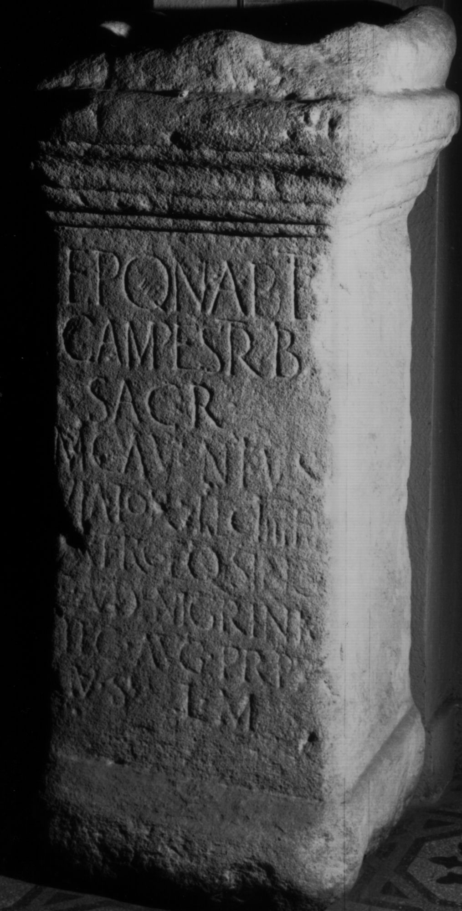
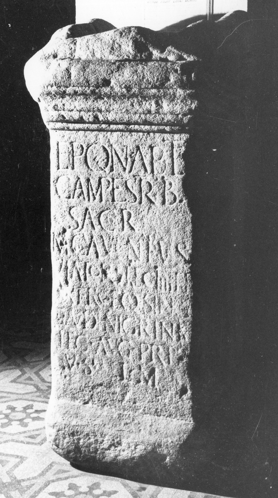

# EDH HD046661. Colonia Ulpia Traiana Sarmizegetusa

**Країна.** Румунія

**Провінція (код EDH).** Dac

**Місце знахідки (антична назва).** Colonia Ulpia Traiana Sarmizegetusa

**Сучасна назва.** Sarmizegetusa

**Координати.** 45.516666699,22.783333299

**Рік знахідки.** 1878

**Зберігання.** Lugoj, Muz. Ist. Etnogr. Arta

**Датування (роки, від'ємні до н. е.).** 111 … 118

**Тип пам'ятки.** Altar

**Розміри (висота, ширина, глибина, см).** 113.0 × 50.0 × 50.0

## Текст (латинь, скорочення розкрито)

```
Eponab(us) et / Campestrib(us) / sacr(um) / M(arcus) Calventius / Viator |(centurio) leg(ionis) IIII F(laviae) F(elicis) / exerc(iator) eq(uitum) sing(ularium) / C(ai) Avidi Nigrini / leg(ati) Aug(usti) pr(o) pr(aetore) / v(otum) s(olvit) l(ibens) m(erito)
```

## Текст у вихідному записі

```
EPONAB ET / CAMPESTRIB / SACR / M CALVENTIVS / VIATOR | LEG IIII F F / EXERC EQ SING / C AVIDI NIGRINI / LEG AVG PR PR / V S L M
```

## Література

CIL 03, 07904.
- ILS 2417.
- IDR 3, 2, 205; fig. 165 (Foto u. Zeichnung).
- PIR (2. Aufl.) A 1408. #

## Фото





Джерело https://edh.ub.uni-heidelberg.de/edh/inschrift/HD046661, ліцензія CC BY-SA 4.0. Оригінальний XML в архіві сирі_дані/edh_xml.zip
