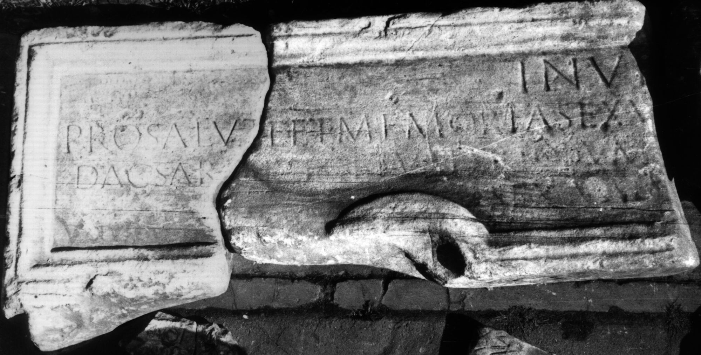

# EDH HD046785. Colonia Ulpia Traiana Sarmizegetusa

**Країна.** Румунія

**Провінція (код EDH).** Dac

**Місце знахідки (антична назва).** Colonia Ulpia Traiana Sarmizegetusa

**Сучасна назва.** Sarmizegetusa

**Координати.** 45.516666699,22.783333299

**Зберігання.** Deva, Muz. Civil. Dac. şi Rom.

**Датування (роки, від'ємні до н. е.).** 107 … 250

**Тип пам'ятки.** Tafel

**Розміри (висота, ширина, глибина, см).** -33.0 × -76.0 × 10.0

## Текст (латинь, скорочення розкрито)

```
Invi[cto ---] / pro salute et memoria Sex(ti) V[aleri --- dec(urionis) col(oniae)] / Dac(icae) Sarmiz(etegusae) et M(arco) Valerio Dum[no---] / Sex(tus) Val[erius Fronto? ---]
```

## Текст у вихідному записі

```
INVI[ ] / PRO SALVTE ET MEMORIA SEX V[ ] / DAC SARMIZ ET M VALERIO DVM[ ] / SEX VAL[ ]
```

## Література

CIL 03, 07959.
- IDR 3, 2, 226; fig. 182 (Foto u. Zeichnung). #

## Фото



Джерело https://edh.ub.uni-heidelberg.de/edh/inschrift/HD046785, ліцензія CC BY-SA 4.0. Оригінальний XML в архіві сирі_дані/edh_xml.zip
