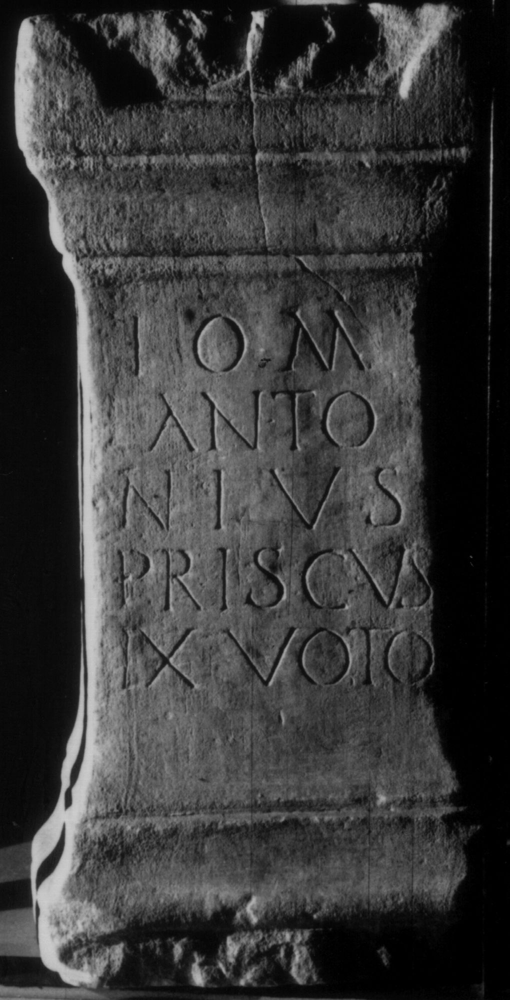

# EDH HD046814. Colonia Ulpia Traiana Sarmizegetusa

**Країна.** Румунія

**Провінція (код EDH).** Dac

**Місце знахідки (антична назва).** Colonia Ulpia Traiana Sarmizegetusa

**Сучасна назва.** Sarmizegetusa

**Координати.** 45.516666699,22.783333299

**Рік знахідки.** 1883

**Зберігання.** Deva, Muz. Civil. Dac. şi Rom.

**Датування (роки, від'ємні до н. е.).** 107 … 250

**Тип пам'ятки.** Altar

**Розміри (висота, ширина, глибина, см).** 65.0 × 32.0 × 26.0

## Текст (латинь, скорочення розкрито)

```
I(ovi) O(ptimo) M(aximo) / Anto/nius / Priscus / ex voto
```

## Текст у вихідному записі

```
I O M / ANTO / NIVS / PRISCVS / EX VOTO
```

## Література

CIL 03, 07909.
- IDR 3, 2, 234; fig. 189. #

## Фото



Джерело https://edh.ub.uni-heidelberg.de/edh/inschrift/HD046814, ліцензія CC BY-SA 4.0. Оригінальний XML в архіві сирі_дані/edh_xml.zip
