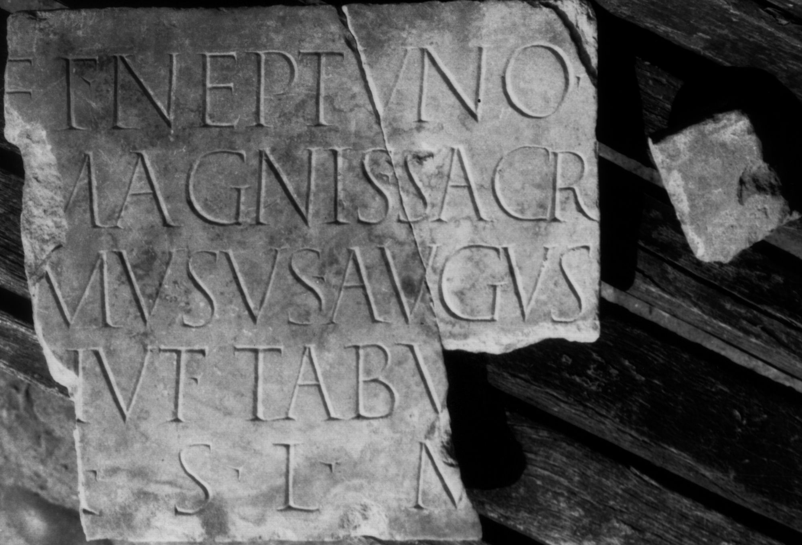

# EDH HD046823. Colonia Ulpia Traiana Sarmizegetusa

**Країна.** Румунія

**Провінція (код EDH).** Dac

**Місце знахідки (антична назва).** Colonia Ulpia Traiana Sarmizegetusa

**Сучасна назва.** Sarmizegetusa

**Координати.** 45.516666699,22.783333299

**Рік знахідки.** 1876

**Зберігання.** Sighişoara, Muzeul

**Датування (роки, від'ємні до н. е.).** 107 … 250

**Тип пам'ятки.** Tafel

**Розміри (висота, ширина, глибина, см).** 36.0 × -33.0 × 2.0

## Текст (латинь, скорочення розкрито)

```
[Iovi] et Neptuno / [Dis] Magnis sacr(um) / [Philo]musus Augus(ti) / [n(ostri) ad]iut(or) tabul(arii) / [v(otum)] s(olvit) l(ibens) m(erito)
```

## Текст у вихідному записі

```
[ ] ET NEPTVNO / [ ] MAGNIS SACR / [ ]MVSVS AVGVS / [ ]IVT TABVL / [ ] S L M
```

## Коментар

(B): IDR: Z. 5 (Anfang): [votu]m.

## Література

CIL 03, 07919.
- IDR 3, 2, 247; fig. 200 (Foto u. Zeichnung). (B) #

## Фото



Джерело https://edh.ub.uni-heidelberg.de/edh/inschrift/HD046823, ліцензія CC BY-SA 4.0. Оригінальний XML в архіві сирі_дані/edh_xml.zip
