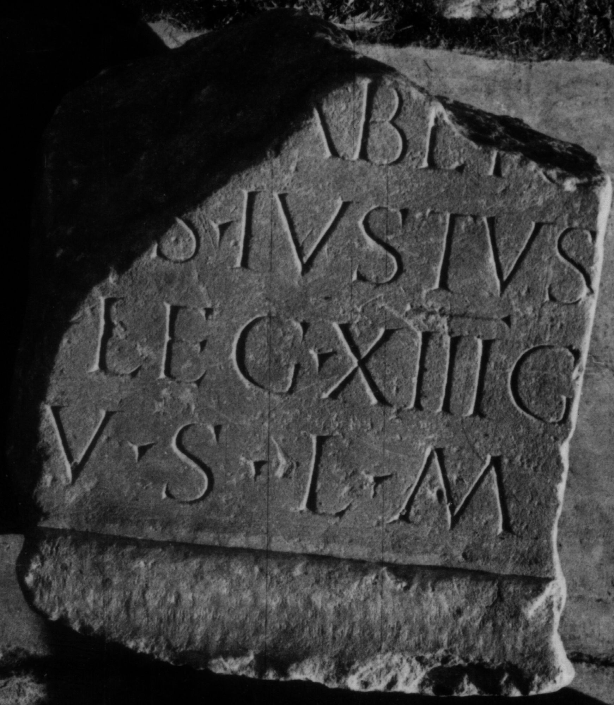

# EDH HD046824. Colonia Ulpia Traiana Sarmizegetusa

**Країна.** Румунія

**Провінція (код EDH).** Dac

**Місце знахідки (антична назва).** Colonia Ulpia Traiana Sarmizegetusa

**Сучасна назва.** Sarmizegetusa

**Координати.** 45.516666699,22.783333299

**Зберігання.** Deva, Muz. Civil. Dac. şi Rom.

**Датування (роки, від'ємні до н. е.).** 107 … 200

**Тип пам'ятки.** Altar

**Розміри (висота, ширина, глибина, см).** -26.0 × -24.0 × -20.0

## Текст (латинь, скорочення розкрито)

```
[I(ovi) O(ptimo) M(aximo)] / [C(aius)? L]aber[i]/[u]s Iustus / [|(centurio)] leg(ionis) XIII g(eminae) / v(otum) s(olvit) l(ibens) m(erito)
```

## Текст у вихідному записі

```
[ ] / [ ]ABER[ ] / [ ]S IVSTVS / [ ] LEG XIII G / V S L M
```

## Література

IDR 3, 2, 248; fig. 201 (Foto u. Zeichnung). #

## Фото



Джерело https://edh.ub.uni-heidelberg.de/edh/inschrift/HD046824, ліцензія CC BY-SA 4.0. Оригінальний XML в архіві сирі_дані/edh_xml.zip
