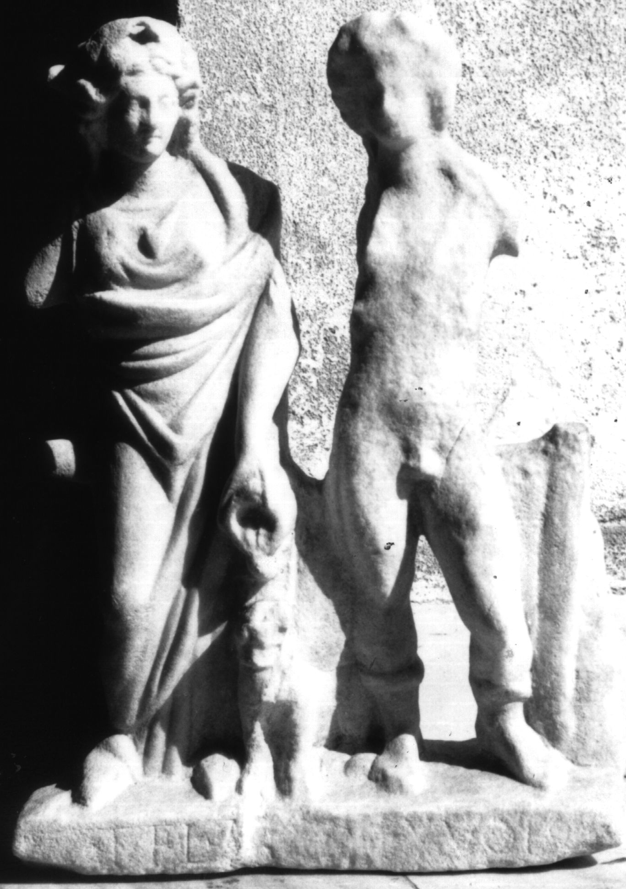

# EDH HD046838. Colonia Ulpia Traiana Sarmizegetusa

**Країна.** Румунія

**Провінція (код EDH).** Dac

**Місце знахідки (антична назва).** Colonia Ulpia Traiana Sarmizegetusa

**Сучасна назва.** Sarmizegetusa

**Координати.** 45.516666699,22.783333299

**Зберігання.** Deva, Muz. Civil. Dac. şi Rom.

**Датування (роки, від'ємні до н. е.).** 131 … 200

**Тип пам'ятки.** Statuenbasis

**Розміри (висота, ширина, глибина, см).** 43.0 × 31.0

## Текст (латинь, скорочення розкрито)

```
T(itus) Fl(avius) A[per] ex voto
```

## Текст у вихідному записі

```
T FL A[ ] EX VOTO
```

## Коментар

Statuettengruppe bestehend aus Liber und Libera auf einer angearbeiteten Basis. Die angegebenen Maße sind die erhaltenen Gesamtabmessungen des Monuments.

## Література

CIL 03, 07917.
- IDR 3, 2, 253; fig. 205 (Foto u. Zeichnung).
- I.I. Russu, AnInstCluj 18, 1975, 59-61, Nr. 3, 3; fig. 3 a; fig. 3 b (Zeichnung). #

## Фото



Джерело https://edh.ub.uni-heidelberg.de/edh/inschrift/HD046838, ліцензія CC BY-SA 4.0. Оригінальний XML в архіві сирі_дані/edh_xml.zip
