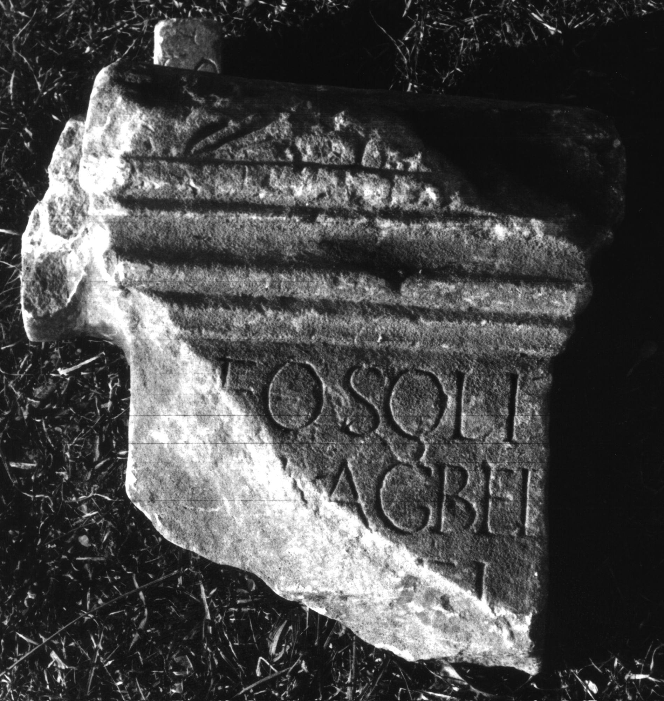

# EDH HD046842. Colonia Ulpia Traiana Sarmizegetusa

**Країна.** Румунія

**Провінція (код EDH).** Dac

**Місце знахідки (антична назва).** Colonia Ulpia Traiana Sarmizegetusa

**Сучасна назва.** Sarmizegetusa

**Деталі знахідки.** {Amphitheater}, bei

**Координати.** 45.516685035,22.785926378

**Рік знахідки.** 1883

**Зберігання.** Deva, Muz. Civil. Dac. şi Rom.

**Датування (роки, від'ємні до н. е.).** 201 … 250

**Тип пам'ятки.** Altar

**Розміри (висота, ширина, глибина, см).** -33.0 × -33.0 × -11.0

## Текст (латинь, скорочення розкрито)

```
[D]eo Soli / [Mal]agbel[i] / [---]EI / [&
```

## Текст у вихідному записі

```
[ ]EO SOLI / [ ]AGBEL[ ] / [ ]EI / [
```

## Література

CIL 03, 07956.
- IDR 3, 2, 265; fig. 217 (Foto u. Zeichnung). #

## Фото



Джерело https://edh.ub.uni-heidelberg.de/edh/inschrift/HD046842, ліцензія CC BY-SA 4.0. Оригінальний XML в архіві сирі_дані/edh_xml.zip
