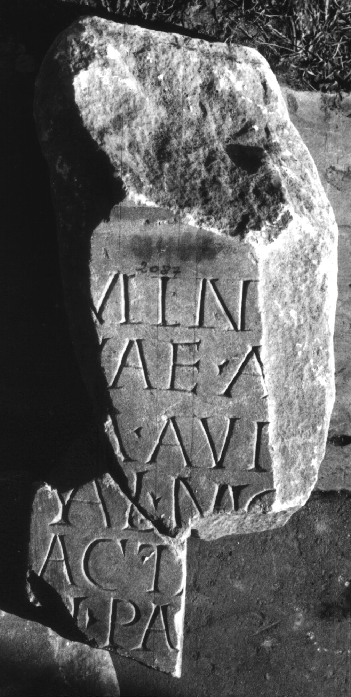

# EDH HD046846. Colonia Ulpia Traiana Sarmizegetusa, aus

**Країна.** Румунія

**Провінція (код EDH).** Dac

**Місце знахідки (антична назва).** Colonia Ulpia Traiana Sarmizegetusa, aus

**Сучасна назва.** Vețel

**Деталі знахідки.** Mintia, {Schloss Gyulai Ferencz}

**Координати.** 45.924968284,22.856369018

**Зберігання.** Deva, Muz. Civil. Dac. şi Rom.

**Датування (роки, від'ємні до н. е.).** 151 … 250

**Матеріал.** Marmor

**Тип пам'ятки.** Altar

**Розміри (висота, ширина, глибина, см).** -55.0 × -20.0 × -20.0

## Текст (латинь, скорочення розкрито)

```
Miner/vae Aug(ustae) / M(arcus) Aur[el(ius)] / Val(ens) mag(ister)(?) k(ampi?) / acta[rius] / [---]l(---) pa[&
```

## Текст у вихідному записі

```
MINER / VAE AVG / M AVR[ ] / VAL MAG K / ACTA[ ] / [ ]L PA[
```

## Література

IDR 3, 2, 270; fig. 222 (Zeichnung). #

## Фото



Джерело https://edh.ub.uni-heidelberg.de/edh/inschrift/HD046846, ліцензія CC BY-SA 4.0. Оригінальний XML в архіві сирі_дані/edh_xml.zip
