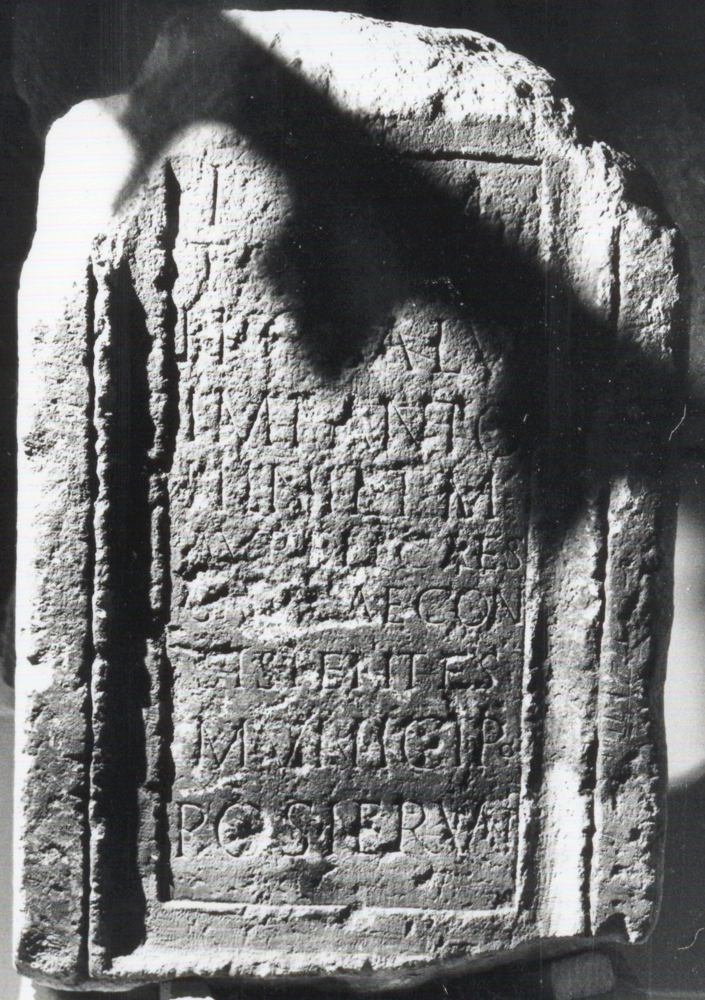

# EDH HD047075. Napoca

**Країна.** Румунія

**Провінція (код EDH).** Dac

**Місце знахідки (антична назва).** Napoca

**Сучасна назва.** Cluj-Napoca

**Деталі знахідки.** {Brückentor}, sekundär verwendet

**Координати.** 46.76667,23.6

**Датування (роки, від'ємні до н. е.).** 139 … 161

**Матеріал.** Gesteine

**Тип пам'ятки.** Altar?

## Текст (латинь, скорочення розкрито)

```
I(ovi) O(ptimo) M(aximo) / Taviano / pro salu(te) / Imp(eratoris) Anto/nini et M(arci) / Aureli Caes(aris) / Gal[at]ae con/sistentes / municipio / pos<u=I>erunt#pos<u>erunt#POSIERUNT
```

## Текст у вихідному записі

```
I O M / TAVIANO / PRO SALV / IMP ANTO / NINI ET M / AVRELI CAES / GAL[ ]AE CON / SISTENTES / MVNICIPIO / POSIERVNT
```

## Література

AE 2004, 1182.
- P. Forisek, in: HPS 11 (Debrecen 2004) 248-250, Nr. 7. - AE 2004.
- CIL 03, 00860.
- ILS 4082.
- AE 2008, 1164.
- C. Onofrei, EphNapocensis 18, 2008, 174-176, Nr. 2. - AE 2008. #

## Фото



Джерело https://edh.ub.uni-heidelberg.de/edh/inschrift/HD047075, ліцензія CC BY-SA 4.0. Оригінальний XML в архіві сирі_дані/edh_xml.zip
