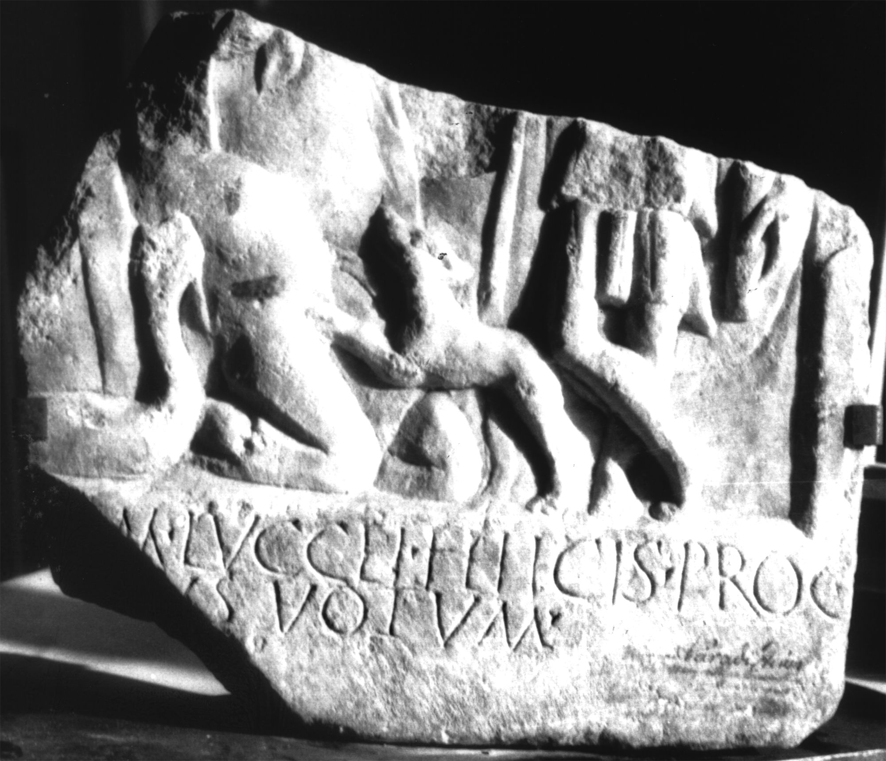

# EDH HD047156. Colonia Ulpia Traiana Sarmizegetusa, aus

**Країна.** Румунія

**Провінція (код EDH).** Dac

**Місце знахідки (антична назва).** Colonia Ulpia Traiana Sarmizegetusa, aus

**Сучасна назва.** Zam

**Деталі знахідки.** {ehemaliges Schloss Nopcsa}

**Координати.** 46.007752922,22.442268133

**Рік знахідки.** -1850

**Зберігання.** Cluj-Napoca, Muz. Naţ. Ist. Transilv.

**Датування (роки, від'ємні до н. е.).** 107 … 250

**Тип пам'ятки.** Relief

**Розміри (висота, ширина, глибина, см).** -26.0 × -31.0 × 4.0

## Текст (латинь, скорочення розкрито)

```
[--- pro salute] M(arci) Luccei Felicis proc(uratoris) / [Augusti --- lib(ertus) ei]us votum
```

## Текст у вихідному записі

```
[ ] M LVCCEI FELICIS PROC / [ ]VS VOTVM
```

## Література

CIL 03, 01437.
- CIL 03, 01437 add. p. 1407.
- IDR 3, 2, 286; fig. 235 (Foto u. Zeichnung).
- CIMRM 2149; Fig. 581.
- CIMRM 2150.
- PIR (2. Aufl.) L 357.
- A. Stein, Die Reichsbeamten von Dazien (Budapest 1944) 83. #

## Фото



Джерело https://edh.ub.uni-heidelberg.de/edh/inschrift/HD047156, ліцензія CC BY-SA 4.0. Оригінальний XML в архіві сирі_дані/edh_xml.zip
