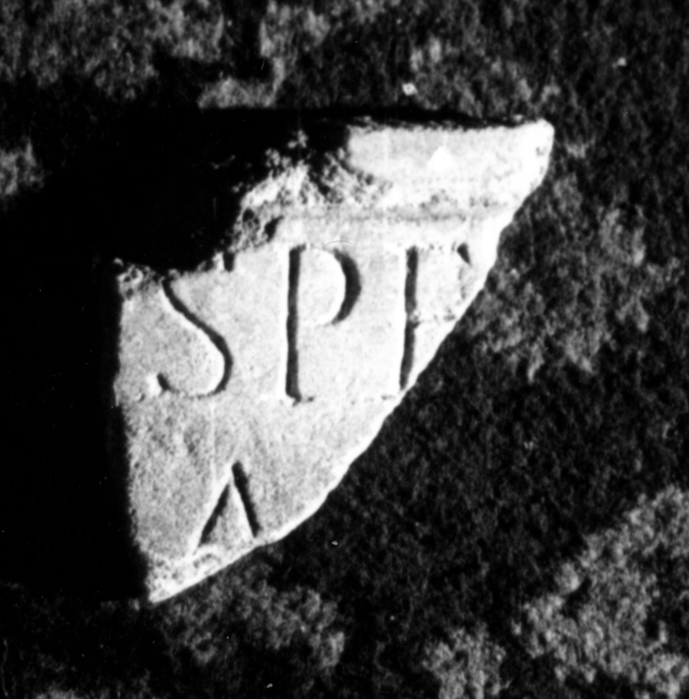

# EDH HD047162. Colonia Ulpia Traiana Sarmizegetusa

**Країна.** Румунія

**Провінція (код EDH).** Dac

**Місце знахідки (антична назва).** Colonia Ulpia Traiana Sarmizegetusa

**Сучасна назва.** Sarmizegetusa

**Деталі знахідки.** Praetorium procuratoris, {area sacra}

**Координати.** 45.515134153,22.787739334

**Датування (роки, від'ємні до н. е.).** 108 … 200

**Тип пам'ятки.** Tafel

**Розміри (висота, ширина, глибина, см).** -8.5 × -9.0 × 1.2

## Текст (латинь, скорочення розкрито)

```
[---]SPE[---] / [---]A[---] / [&
```

## Текст у вихідному записі

```
[ ]SPE[ ] / [ ]A[ ] / [
```

## Коментар

Oberhalb von Z. 1 ein Teil eines profilierten Rahmens erhalten.

## Література

I. Piso, ZPE 120, 1998, 270, Nr. 22; Foto. #

## Фото



Джерело https://edh.ub.uni-heidelberg.de/edh/inschrift/HD047162, ліцензія CC BY-SA 4.0. Оригінальний XML в архіві сирі_дані/edh_xml.zip
