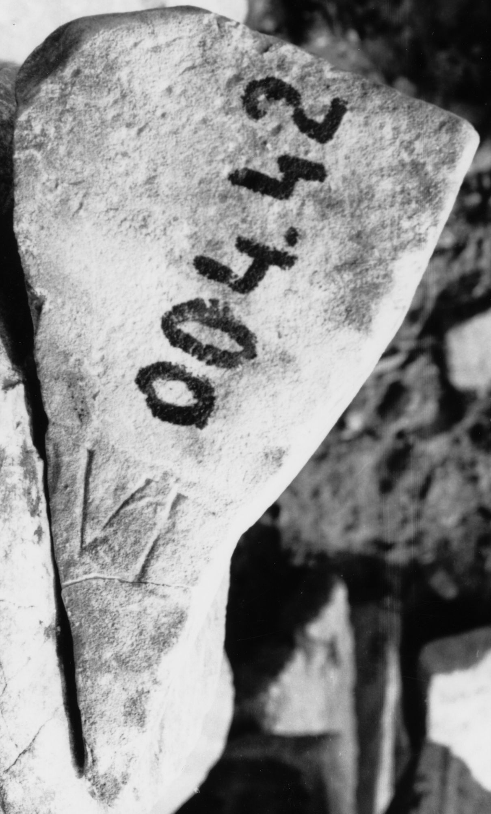

# EDH HD047166. Colonia Ulpia Traiana Sarmizegetusa

**Країна.** Румунія

**Провінція (код EDH).** Dac

**Місце знахідки (антична назва).** Colonia Ulpia Traiana Sarmizegetusa

**Сучасна назва.** Sarmizegetusa

**Деталі знахідки.** Praetorium procuratoris, {area sacra}

**Координати.** 45.515134153,22.787739334

**Датування (роки, від'ємні до н. е.).** 171 … 250

**Тип пам'ятки.** Altar?

**Розміри (висота, ширина, глибина, см).** -36.0 × -22.0 × -26.0

## Текст (латинь, скорочення розкрито)

```
[---]que / [&
```

## Текст у вихідному записі

```
[ ]QVE / [
```

## Коментар

Altar oder Statuenbasis.

## Література

I. Piso, ZPE 120, 1998, 268, Nr. 17; Foto. #

## Фото



Джерело https://edh.ub.uni-heidelberg.de/edh/inschrift/HD047166, ліцензія CC BY-SA 4.0. Оригінальний XML в архіві сирі_дані/edh_xml.zip
