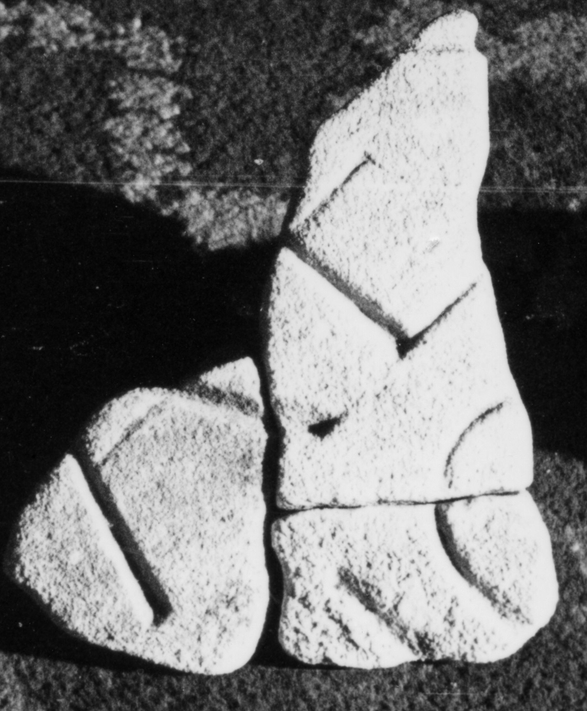

# EDH HD047167. Colonia Ulpia Traiana Sarmizegetusa

**Країна.** Румунія

**Провінція (код EDH).** Dac

**Місце знахідки (антична назва).** Colonia Ulpia Traiana Sarmizegetusa

**Сучасна назва.** Sarmizegetusa

**Деталі знахідки.** Praetorium procuratoris, {area sacra}

**Координати.** 45.515134153,22.787739334

**Датування (роки, від'ємні до н. е.).** 108 … 200

**Тип пам'ятки.** Tafel

**Розміри (висота, ширина, глибина, см).** -12.0 × -17.0 × 7.0

## Текст (латинь, скорочення розкрито)

```
$]A EX[---] / [---]I(?)O(?)[&
```

## Текст у вихідному записі

```
]A EX[ ] / [ ]IO[
```

## Коментар

3 aneinanderpassende Fragmente.

## Література

I. Piso, ZPE 120, 1998, 270, Nr. 24; Foto. #

## Фото



Джерело https://edh.ub.uni-heidelberg.de/edh/inschrift/HD047167, ліцензія CC BY-SA 4.0. Оригінальний XML в архіві сирі_дані/edh_xml.zip
