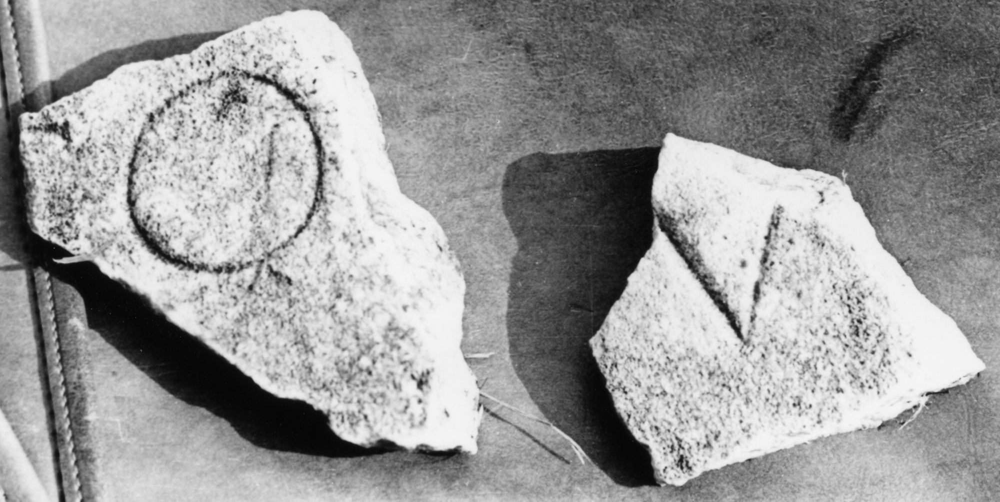

# EDH HD047168. Colonia Ulpia Traiana Sarmizegetusa

**Країна.** Румунія

**Провінція (код EDH).** Dac

**Місце знахідки (антична назва).** Colonia Ulpia Traiana Sarmizegetusa

**Сучасна назва.** Sarmizegetusa

**Деталі знахідки.** Praetorium procuratoris, {area sacra}

**Координати.** 45.515134153,22.787739334

**Датування (роки, від'ємні до н. е.).** 108 … 200

**Тип пам'ятки.** Tafel

**Розміри (висота, ширина, глибина, см).** -10.0 × -8.0 × 3.5

## Текст (латинь, скорочення розкрито)

```
$]C(?)O[---] / [---]V(?)[& // $]V(?)[&
```

## Текст у вихідному записі

```
]CO[ ] / [ ]V[ / / ]V[
```

## Коментар

2 nicht aneinanderpassende Fragmente erhalten; Maße beziehen sich auf Fragment a; Maße b: (7) x (7) x 3 cm.

## Література

I. Piso, ZPE 120, 1998, 271, Nr. 25; Foto. #

## Фото



Джерело https://edh.ub.uni-heidelberg.de/edh/inschrift/HD047168, ліцензія CC BY-SA 4.0. Оригінальний XML в архіві сирі_дані/edh_xml.zip
