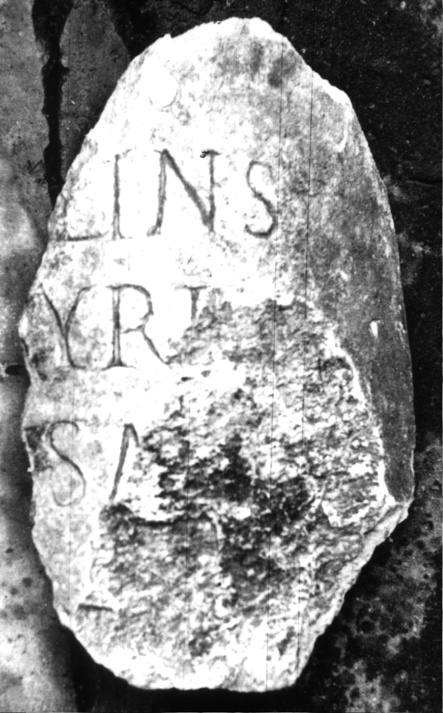

# EDH HD047207. Colonia Ulpia Traiana Sarmizegetusa

**Країна.** Румунія

**Провінція (код EDH).** Dac

**Місце знахідки (антична назва).** Colonia Ulpia Traiana Sarmizegetusa

**Сучасна назва.** Sarmizegetusa

**Деталі знахідки.** {Tempel der syrischen Götter}

**Координати.** 45.511880680,22.775280474

**Рік знахідки.** 1882

**Зберігання.** Deva, Muz. Civil. Dac. şi Rom.

**Датування (роки, від'ємні до н. е.).** 107 … 250

**Тип пам'ятки.** EhrenVotivsäule

**Розміри (висота, ширина, глибина, см).** -29.0 × -18.0

## Текст (латинь, скорочення розкрито)

```
[---]S / [---]lin(u)s / [---] Syri / [---] Sa[rmiz(egetusae)] / [&
```

## Текст у вихідному записі

```
[ ]S / [ ]LINS / [ ] SYRI / [ ] SA[ ] / [
```

## Література

CIL 03, 07943.
- IDR 3, 2, 298; fig. 246 (Foto u. Zeichnung).
- CIMRM 2145. #

## Фото



Джерело https://edh.ub.uni-heidelberg.de/edh/inschrift/HD047207, ліцензія CC BY-SA 4.0. Оригінальний XML в архіві сирі_дані/edh_xml.zip
