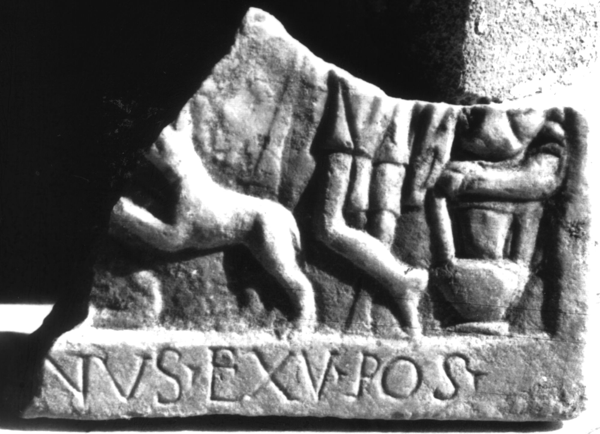

# EDH HD047209. Colonia Ulpia Traiana Sarmizegetusa

**Країна.** Румунія

**Провінція (код EDH).** Dac

**Місце знахідки (антична назва).** Colonia Ulpia Traiana Sarmizegetusa

**Сучасна назва.** Sarmizegetusa

**Деталі знахідки.** {Mithraeum}

**Координати.** 45.509200322,22.783944010

**Рік знахідки.** 1882

**Зберігання.** Deva, Muz. Civil. Dac. şi Rom.

**Датування (роки, від'ємні до н. е.).** 107 … 250

**Тип пам'ятки.** Relief

**Розміри (висота, ширина, глибина, см).** -17.0 × -23.0 × 3.0

## Текст (латинь, скорочення розкрито)

```
[---]nus ex v(oto) pos(uit)
```

## Текст у вихідному записі

```
[ ]NVS EX V POS
```

## Література

CIL 03, 07931.
- IDR 3, 2, 300; fig. 248.
- CIMRM 2060.
- CIMRM 2061. #

## Фото



Джерело https://edh.ub.uni-heidelberg.de/edh/inschrift/HD047209, ліцензія CC BY-SA 4.0. Оригінальний XML в архіві сирі_дані/edh_xml.zip
