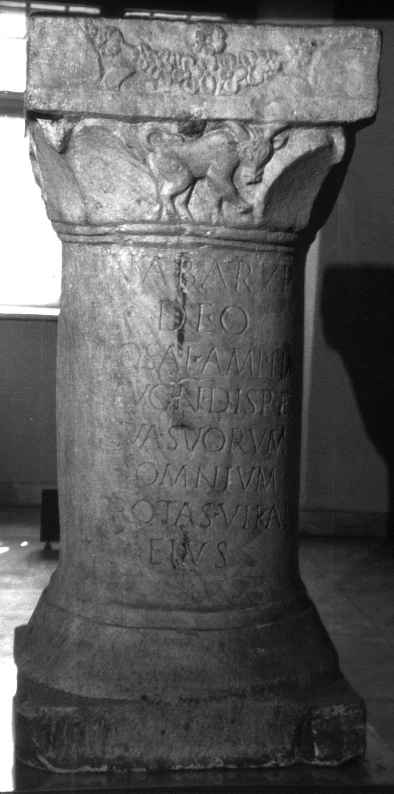
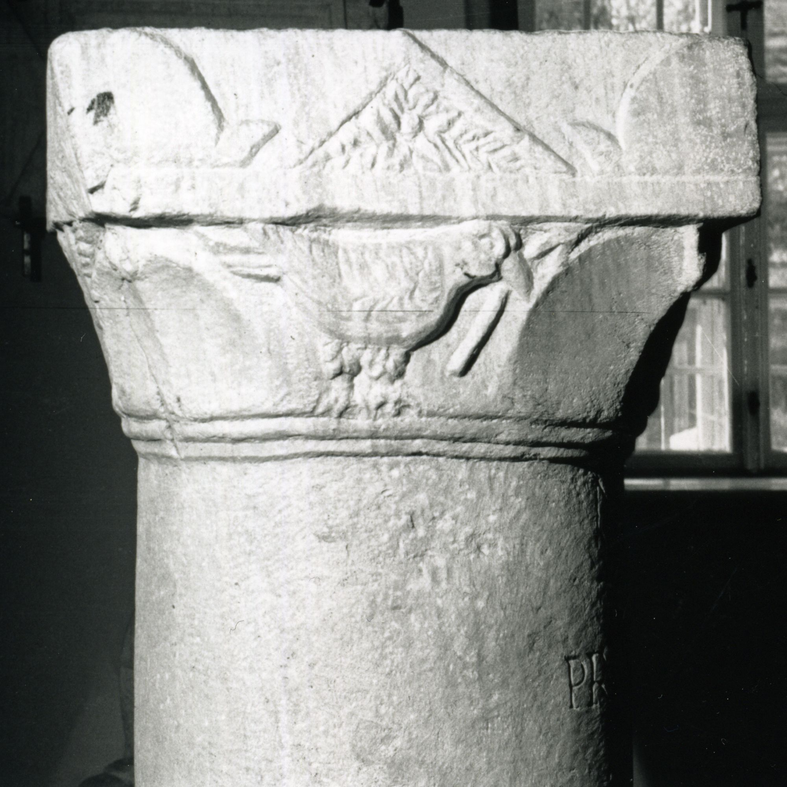
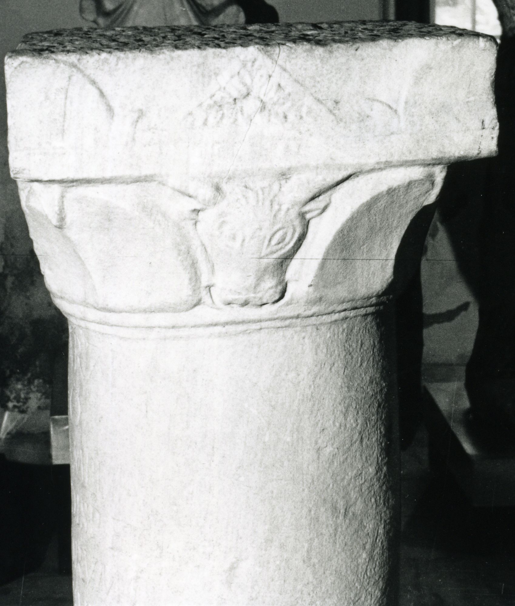
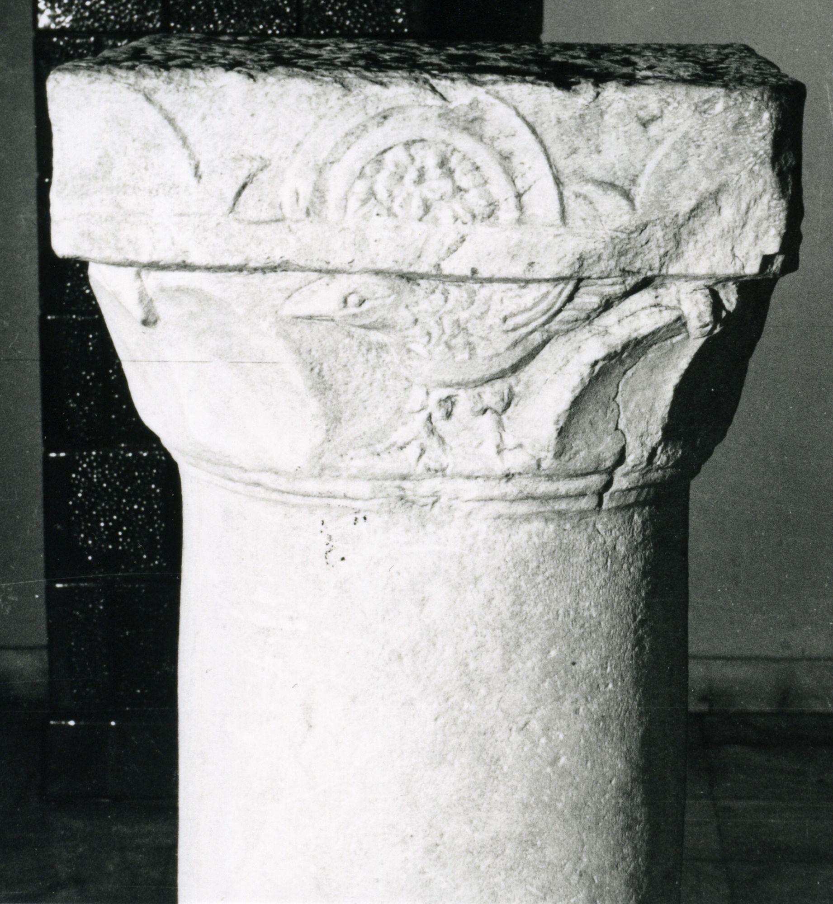

# EDH HD047216. Colonia Ulpia Traiana Sarmizegetusa

**Країна.** Румунія

**Провінція (код EDH).** Dac

**Місце знахідки (антична назва).** Colonia Ulpia Traiana Sarmizegetusa

**Сучасна назва.** Sarmizegetusa

**Деталі знахідки.** {Mithraeum}

**Координати.** 45.509200322,22.783944010

**Рік знахідки.** 1881

**Зберігання.** Deva, Muz. Civil. Dac. şi Rom.

**Датування (роки, від'ємні до н. е.).** 107 … 250

**Тип пам'ятки.** EhrenVotivsäule

**Розміри (висота, ширина, глибина, см).** 119.0 × 56.0

## Текст (латинь, скорочення розкрито)

```
Nabarze / deo / pro sal(ute) Ampliati / Aug(usti) n(ostri) disp(ensatoris) et / sua suorumq(ue) / omnium / Protas vikar(ius)(!) / eius
```

## Текст у вихідному записі

```
NABARZE / DEO / PRO SAL AMPLIATI / AVG N DISP ET / SVA SVORVMQ / OMNIVM / PROTAS VIKAR / EIVS
```

## Література

IDR 3, 2, 307; fig. 252 (Foto u. Zeichnungen).
- CIL 03, 07938.
- CIMRM 2028; Fig. 532.
- CIMRM 2029.
- F. Studniczka, AEM 7, 1883, 225, s.n. 69; Taf. 8, 1 (Zeichnungen). #

## Фото









Джерело https://edh.ub.uni-heidelberg.de/edh/inschrift/HD047216, ліцензія CC BY-SA 4.0. Оригінальний XML в архіві сирі_дані/edh_xml.zip
