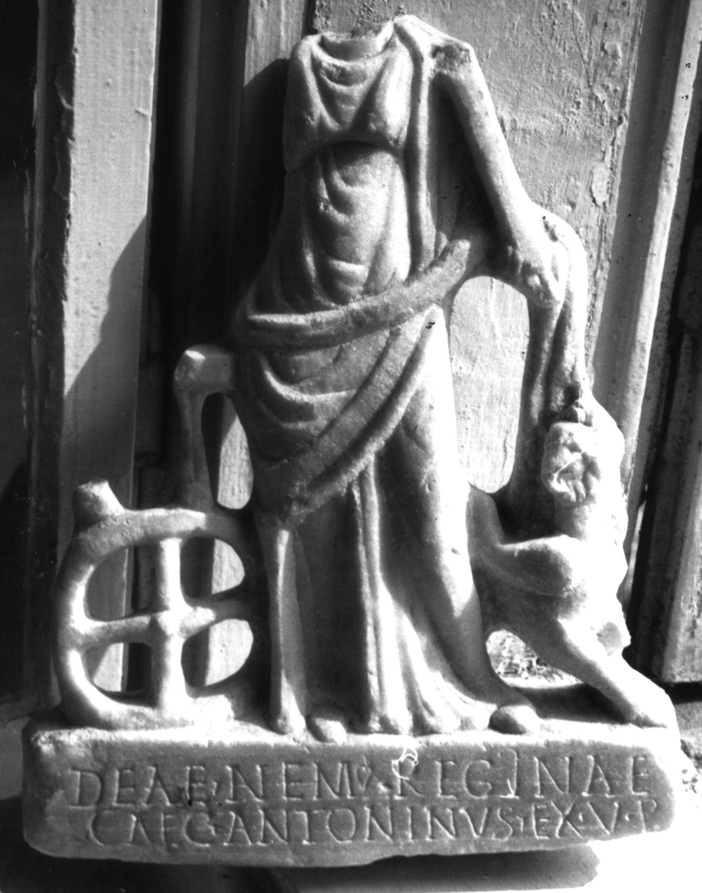

# EDH HD047218. Colonia Ulpia Traiana Sarmizegetusa

**Країна.** Румунія

**Провінція (код EDH).** Dac

**Місце знахідки (антична назва).** Colonia Ulpia Traiana Sarmizegetusa

**Сучасна назва.** Sarmizegetusa

**Деталі знахідки.** {Amphitheater}

**Координати.** 45.516685035,22.785926378

**Зберігання.** Deva, Muz. Civil. Dac. şi Rom.

**Датування (роки, від'ємні до н. е.).** 107 … 250

**Тип пам'ятки.** Statuenbasis

**Розміри (висота, ширина, глибина, см).** -30.0 × 20.0

## Текст (латинь, скорочення розкрито)

```
Deae Nem(esi) Reginae / Caec(ilius) Antoninus ex v(oto) p(osuit)
```

## Текст у вихідному записі

```
DEAE NEM REGINAE / CAEC ANTONINVS EX V P
```

## Коментар

Statuengruppe mit angearbeiteter Statuenbasis. Die Abmessungen beziehen sich auf die erhaltenen Teile des gesamten Monuments.

## Література

CIL 03, 13777.
- IDR 3, 2, 313; fig. 258. #

## Фото



Джерело https://edh.ub.uni-heidelberg.de/edh/inschrift/HD047218, ліцензія CC BY-SA 4.0. Оригінальний XML в архіві сирі_дані/edh_xml.zip
