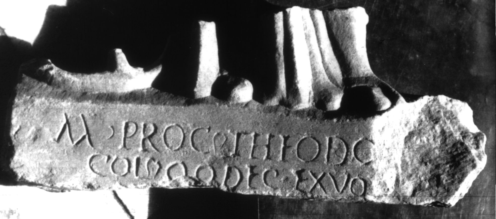

# EDH HD047222. Colonia Ulpia Traiana Sarmizegetusa

**Країна.** Румунія

**Провінція (код EDH).** Dac

**Місце знахідки (антична назва).** Colonia Ulpia Traiana Sarmizegetusa

**Сучасна назва.** Sarmizegetusa

**Деталі знахідки.** {Amphitheater}

**Координати.** 45.516685035,22.785926378

**Зберігання.** Deva, Muz. Civil. Dac. şi Rom.

**Датування (роки, від'ємні до н. е.).** 107 … 250

**Тип пам'ятки.** Statuenbasis

**Розміри (висота, ширина, глибина, см).** -15.0 × -23.0 × 7.0

## Текст (латинь, скорочення розкрито)

```
M(arcus) Proci(lius) Theodo[rus IIvir?] / col(oniae) q(uin)q(uennalis) dec(urio) ex vot[o pos(uit)]
```

## Текст у вихідному записі

```
M PROCI THEODO[ ] / COL QQ DEC EX VOT[ ]
```

## Коментар

Statuengruppe auf einer angearbeiteten Basis. Die angegebenen Abmessungen beziehen sich auf das (fragmentarische) Gesamtmonument.

## Література

CIL 03, 13783.
- IDR 3, 2, 318; fig. 263. #

## Фото



Джерело https://edh.ub.uni-heidelberg.de/edh/inschrift/HD047222, ліцензія CC BY-SA 4.0. Оригінальний XML в архіві сирі_дані/edh_xml.zip
