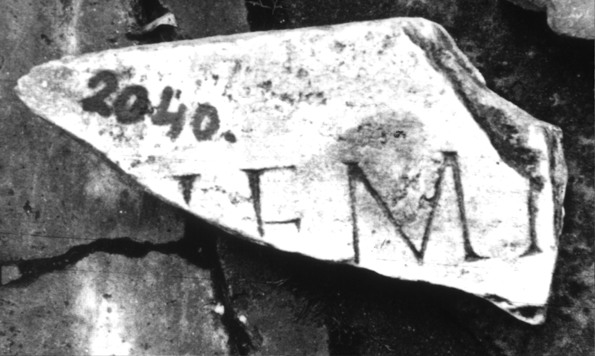
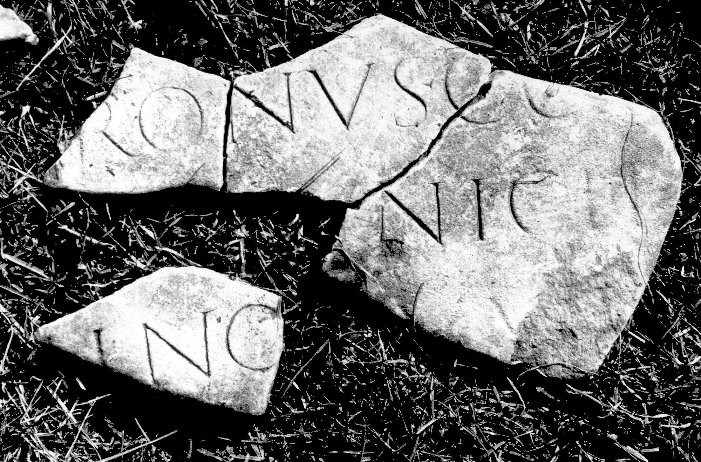
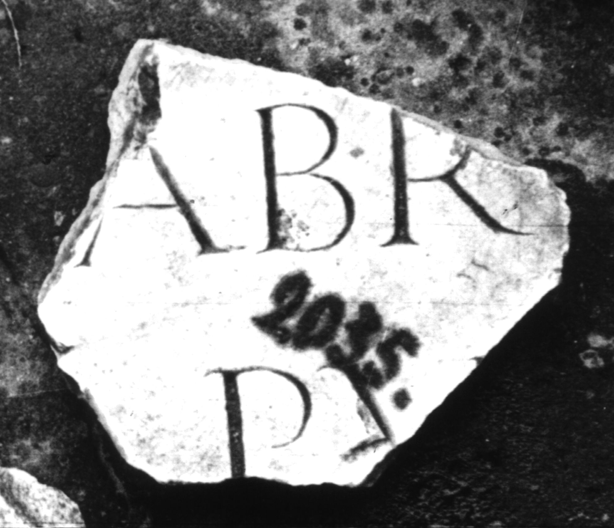
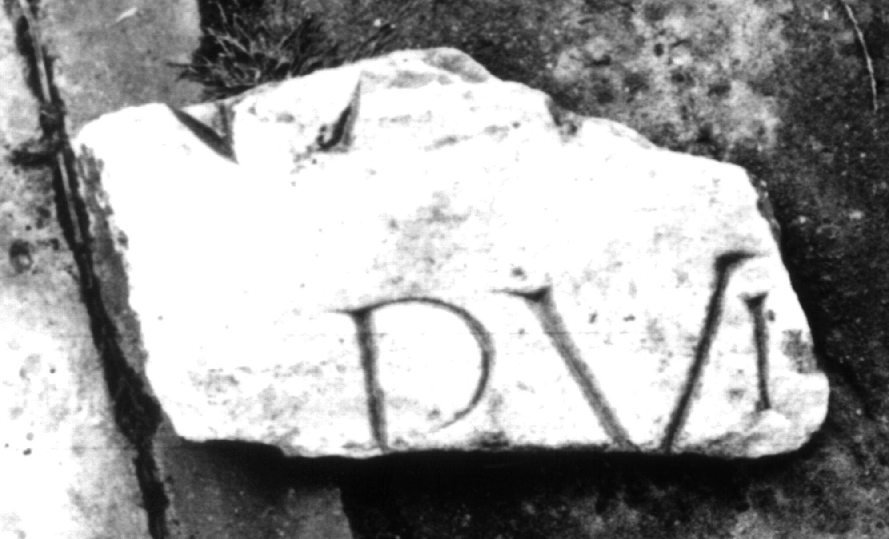
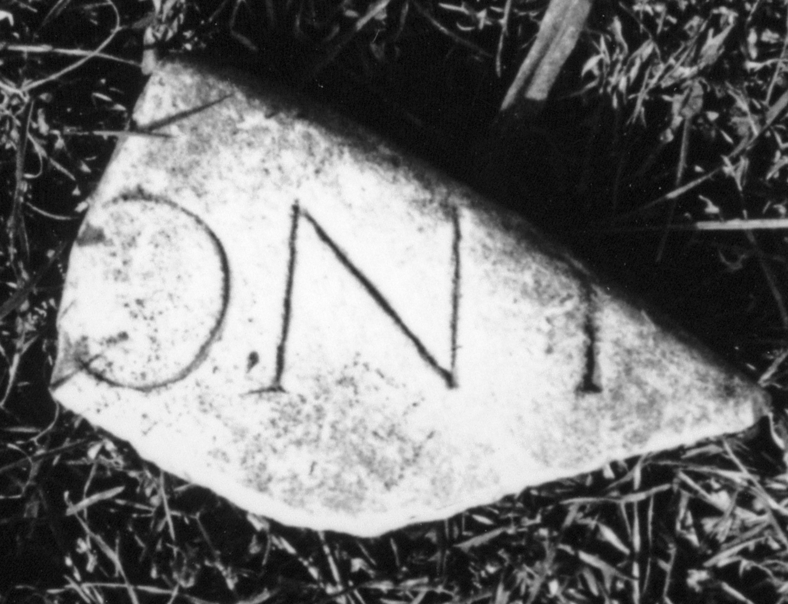
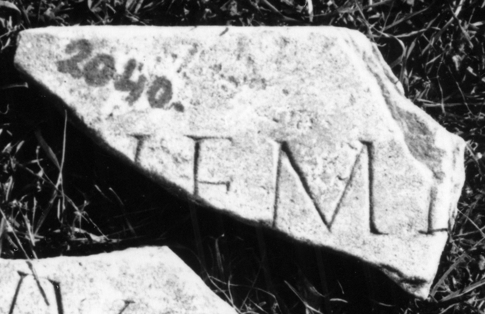

# EDH HD047267. Colonia Ulpia Traiana Sarmizegetusa

**Країна.** Румунія

**Провінція (код EDH).** Dac

**Місце знахідки (антична назва).** Colonia Ulpia Traiana Sarmizegetusa

**Сучасна назва.** Sarmizegetusa

**Деталі знахідки.** {Amphitheater}, bei

**Координати.** 45.516685035,22.785926378

**Зберігання.** Deva, Muz. Civil. Dac. şi Rom.

**Датування (роки, від'ємні до н. е.).** 107 … 250

**Тип пам'ятки.** Tafel

## Текст (латинь, скорочення розкрито)

```
Neme[si ---] / [---]O[---] / [--- Ant]oni[us ---] / [pat]ronus co[ll(egii) f]abr(um) / [--- mu]nicip[ii A]pul(ensis) / [---]VMV[---]NA / [---] Apul(ensis?)
```

## Текст у вихідному записі

```
NEME[ ] / [ ]O[ ] / [ ]ONI[ ] / [ ]RONVS CO[ ]ABR / [ ]NICIP[ ]PVL / [ ]VMV[ ]NA / [ ] APVL
```

## Коментар

Sieben teilweise aneinander passende Fragmente erhalten.

## Література

IDR 3, 2, 326; fig. 269 (Foto u. Zeichnung).
- CIL 03, 13786; Zeichnung. #

## Фото













Джерело https://edh.ub.uni-heidelberg.de/edh/inschrift/HD047267, ліцензія CC BY-SA 4.0. Оригінальний XML в архіві сирі_дані/edh_xml.zip
