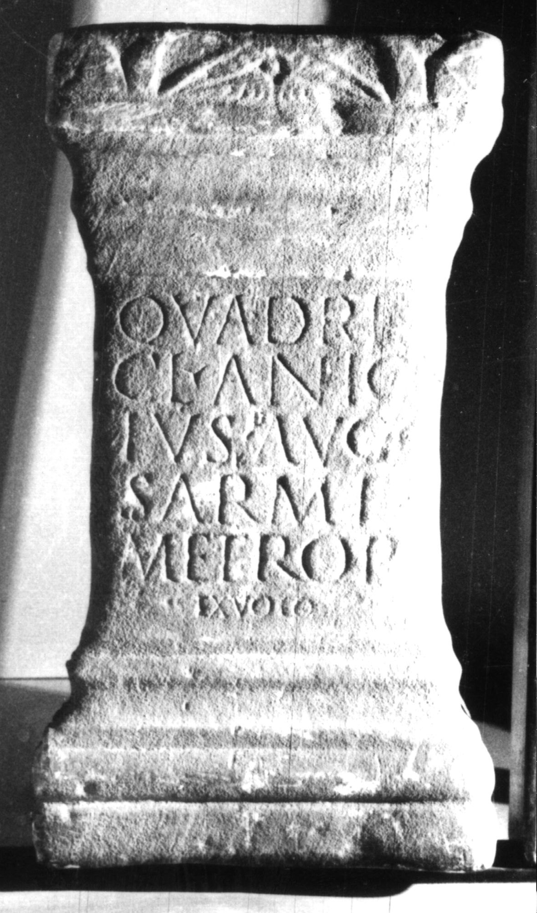

# EDH HD047277. Colonia Ulpia Traiana Sarmizegetusa, bei

**Країна.** Румунія

**Провінція (код EDH).** Dac

**Місце знахідки (антична назва).** Colonia Ulpia Traiana Sarmizegetusa, bei

**Сучасна назва.** Toteşti

**Деталі знахідки.** Păclişa, {Schloss Pogány}

**Координати.** 45.562608684,22.880331861

**Рік знахідки.** 1840

**Зберігання.** Deva, Muz. Civil. Dac. şi Rom.

**Датування (роки, від'ємні до н. е.).** 222 … 250

**Тип пам'ятки.** Altar

**Розміри (висота, ширина, глибина, см).** 58.0 × 32.0 × 25.0

## Текст (латинь, скорочення розкрито)

```
Quadrib(is!) / Cl(audius) Anic[e]/tus Aug(ustalis) c(oloniae) / Sarmiz(egetusae) / metrop(olis) / ex voto
```

## Текст у вихідному записі

```
QVADRIB / CL ANIC[ ] / TVS AVG C / SARMIZ / METROP / EX VOTO
```

## Література

CIL 03, 01440.
- CIL 03, 01440 add. p. 1407.
- IDR 3, 2, 330; fig. 273 (Foto u. Zeichnung). #

## Фото



Джерело https://edh.ub.uni-heidelberg.de/edh/inschrift/HD047277, ліцензія CC BY-SA 4.0. Оригінальний XML в архіві сирі_дані/edh_xml.zip
