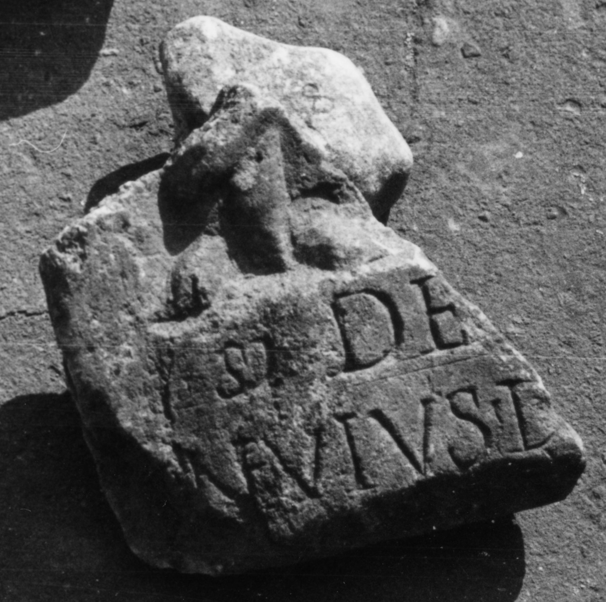

# EDH HD047312. Colonia Ulpia Traiana Sarmizegetusa

**Країна.** Румунія

**Провінція (код EDH).** Dac

**Місце знахідки (антична назва).** Colonia Ulpia Traiana Sarmizegetusa

**Сучасна назва.** Sarmizegetusa

**Деталі знахідки.** {Amphitheater}

**Координати.** 45.516685035,22.785926378

**Зберігання.** Deva, Muz. Civil. Dac. şi Rom.

**Датування (роки, від'ємні до н. е.).** 107 … 250

**Тип пам'ятки.** Relief

**Розміри (висота, ширина, глибина, см).** -10.0 × -9.0 × 2.0

## Текст (латинь, скорочення розкрито)

```
Si(lvano?) Deo [---] / N(a)evius D[---]
```

## Текст у вихідному записі

```
SI DEO [ ] / NEVIVS D[ ]
```

## Література

CIL 03, 13780.
- IDR 3, 2, 336; fig. 279 (Foto u. Zeichnung). #

## Фото



Джерело https://edh.ub.uni-heidelberg.de/edh/inschrift/HD047312, ліцензія CC BY-SA 4.0. Оригінальний XML в архіві сирі_дані/edh_xml.zip
