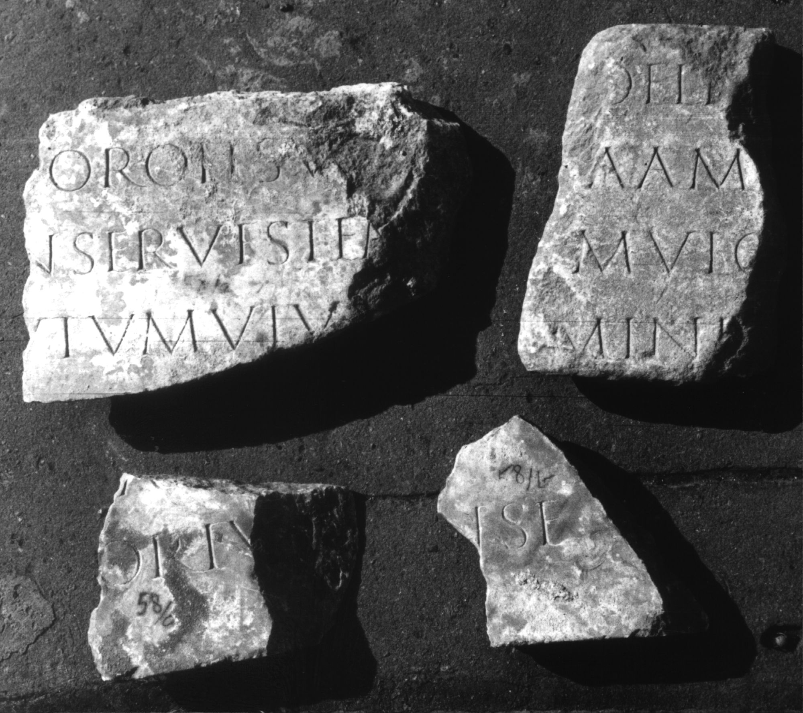

# EDH HD047331. Colonia Ulpia Traiana Sarmizegetusa

**Країна.** Румунія

**Провінція (код EDH).** Dac

**Місце знахідки (антична назва).** Colonia Ulpia Traiana Sarmizegetusa

**Сучасна назва.** Sarmizegetusa

**Координати.** 45.516666699,22.783333299

**Зберігання.** Deva, Muz. Civil. Dac. şi Rom.

**Датування (роки, від'ємні до н. е.).** 107 … 250

**Тип пам'ятки.** Tafel

**Розміри (висота, ширина, глибина, см).** 27.0 × 18.0 × 5.0

## Текст (латинь, скорочення розкрито)

```
$] Porolis(s)u[m ---] / [--- co]nserves tem[pore expeditionis?] / [---]utum viv[um & // $]DELM[---] / [---]a amu[---] / [reduce]m(?) vic[toremque? facias? ---] / [---]MINI[& // $]A[---] / [---]ORIV[& // $]NSE[&
```

## Текст у вихідному записі

```
] POROLISV[ ] / [ ]NSERVES TEM[ ] / [ ]VTVM VIV[ / / ]DELM[ ] / [ ]A AMV[ ] / [ ]M VIC[ ] / [ ]MINI[ / / ]A[ ] / [ ]ORIV[ / / ]NSE[
```

## Коментар

Vier nicht aneinander passende Fragmente erhalten. Abmessungen des größten Fragments [a)] s. o.; Abmessungen der überigen Fragmente: b) 22 x 16 x 5, c) 12 x 15 x 5, d) 13 x 13 x 5. Nach IDR möglicherweise ein votorum carmen.

## Література

CIL 03, 07986.
- IDR 3, 2, 352; fig. 292. #

## Фото



Джерело https://edh.ub.uni-heidelberg.de/edh/inschrift/HD047331, ліцензія CC BY-SA 4.0. Оригінальний XML в архіві сирі_дані/edh_xml.zip
