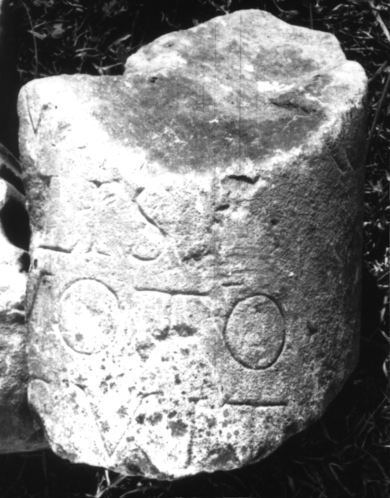

# EDH HD047389. Colonia Ulpia Traiana Sarmizegetusa

**Країна.** Румунія

**Провінція (код EDH).** Dac

**Місце знахідки (антична назва).** Colonia Ulpia Traiana Sarmizegetusa

**Сучасна назва.** Sarmizegetusa

**Координати.** 45.516666699,22.783333299

**Рік знахідки.** 1889

**Зберігання.** Deva, Muz. Civil. Dac. şi Rom.

**Датування (роки, від'ємні до н. е.).** 222 … 250

**Тип пам'ятки.** EhrenVotivsäule

**Розміри (висота, ширина, глибина, см).** -20.0 × 20.0

## Текст (латинь, скорочення розкрито)

```
$] / [Sarm(izegetusae)] m[et]ro/[po]lis / [ex] voto / [po]suit
```

## Текст у вихідному записі

```
] / [ ] M[ ]RO / [ ]LIS / [ ] VOTO / [ ]SVIT
```

## Література

IDR 3, 2, 358; fig. 295 (Fotos u. Zeichnung).
- CIL 03, 12585. #

## Фото



Джерело https://edh.ub.uni-heidelberg.de/edh/inschrift/HD047389, ліцензія CC BY-SA 4.0. Оригінальний XML в архіві сирі_дані/edh_xml.zip
