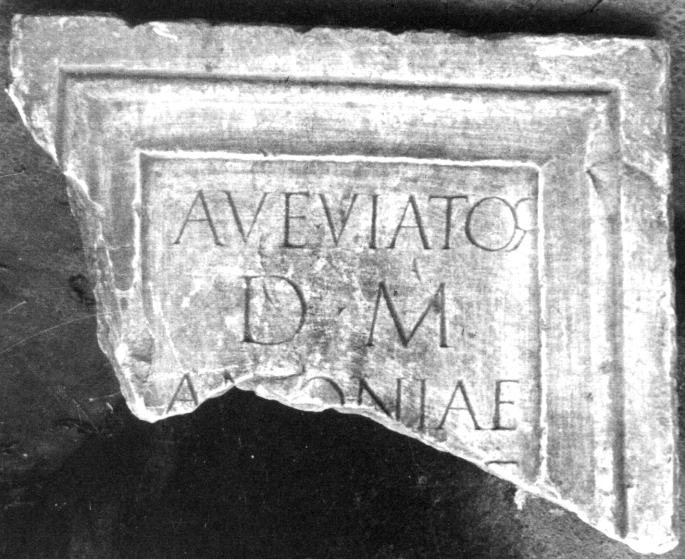

# EDH HD047398. Colonia Ulpia Traiana Sarmizegetusa

**Країна.** Румунія

**Провінція (код EDH).** Dac

**Місце знахідки (антична назва).** Colonia Ulpia Traiana Sarmizegetusa

**Сучасна назва.** Sarmizegetusa

**Координати.** 45.516666699,22.783333299

**Зберігання.** Deva, Muz. Civil. Dac. şi Rom.; verschollen

**Датування (роки, від'ємні до н. е.).** 107 … 250

**Розміри (висота, ширина, глибина, см).** -48.0 × -62.0 × 14.0

## Текст (латинь, скорочення розкрито)

```
Ave viator / D(is) M(anibus) / Antoniae / [---]F / SEC[&
```

## Текст у вихідному записі

```
AVE VIATOR / D M / ANTONIAE / [ ]F / SEC[
```

## Коментар

Zwei Teile bekannt. Der obere Teil (Z. 1-3) befindet sich in Deva; ein nach unten anschließendes Fragment (Z. 4-5) ist verschollen.

## Література

CIL 03, 07987.
- IDR 3, 2, 381; fig. 310 (Foto u. Zeichnung). #

## Фото



Джерело https://edh.ub.uni-heidelberg.de/edh/inschrift/HD047398, ліцензія CC BY-SA 4.0. Оригінальний XML в архіві сирі_дані/edh_xml.zip
